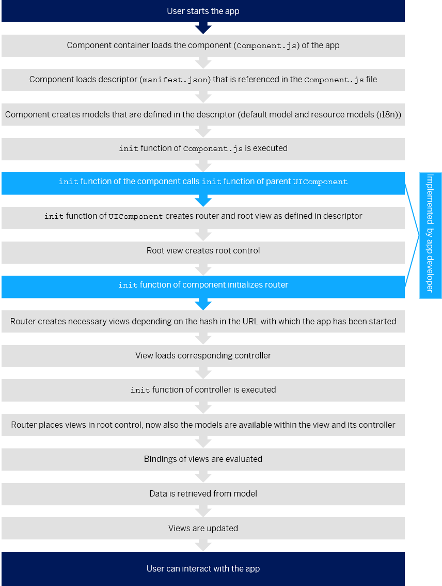

<!-- loiod2f58695fce3476f92fdfc07c9e8f7c6 -->

| loio |
| -----|
| d2f58695fce3476f92fdfc07c9e8f7c6 |

view on: [demo kit nightly build](https://sdk.openui5.org/nightly/#/topic/d2f58695fce3476f92fdfc07c9e8f7c6) | [demo kit latest release](https://sdk.openui5.org/topic/d2f58695fce3476f92fdfc07c9e8f7c6)

## App Initialization: What Happens When an App Is Started?

When a user starts an app \(in the SAP Fiori launchpad \(FLP\) or using an HTML page\), several steps will be performed in the background.

***

-   [App Initialization: What Happens When an App Is Started?](App_Initialization_What_Happens_When_an_App_Is_Started_d2f5869.md)
-   [App Initialization: What Happens When an App Is Started?](App_Initialization_What_Happens_When_an_App_Is_Started_d2f5869.md)
-   [App Initialization: What Happens When an App Is Started?](App_Initialization_What_Happens_When_an_App_Is_Started_d2f5869.md)
-   [App Initialization: What Happens When an App Is Started?](App_Initialization_What_Happens_When_an_App_Is_Started_d2f5869.md)
-   [App Initialization: What Happens When an App Is Started?](App_Initialization_What_Happens_When_an_App_Is_Started_d2f5869.md)
-   [App Initialization: What Happens When an App Is Started?](App_Initialization_What_Happens_When_an_App_Is_Started_d2f5869.md)
-   [App Initialization: What Happens When an App Is Started?](App_Initialization_What_Happens_When_an_App_Is_Started_d2f5869.md)
-   [App Initialization: What Happens When an App Is Started?](App_Initialization_What_Happens_When_an_App_Is_Started_d2f5869.md)
-   [App Initialization: What Happens When an App Is Started?](App_Initialization_What_Happens_When_an_App_Is_Started_d2f5869.md)
-   [App Initialization: What Happens When an App Is Started?](App_Initialization_What_Happens_When_an_App_Is_Started_d2f5869.md)
-   [App Initialization: What Happens When an App Is Started?](App_Initialization_What_Happens_When_an_App_Is_Started_d2f5869.md)
-   [App Initialization: What Happens When an App Is Started?](App_Initialization_What_Happens_When_an_App_Is_Started_d2f5869.md)
-   [App Initialization: What Happens When an App Is Started?](App_Initialization_What_Happens_When_an_App_Is_Started_d2f5869.md)
-   [App Initialization: What Happens When an App Is Started?](App_Initialization_What_Happens_When_an_App_Is_Started_d2f5869.md)
-   [App Initialization: What Happens When an App Is Started?](App_Initialization_What_Happens_When_an_App_Is_Started_d2f5869.md)
-   [App Initialization: What Happens When an App Is Started?](App_Initialization_What_Happens_When_an_App_Is_Started_d2f5869.md)
-   [App Initialization: What Happens When an App Is Started?](App_Initialization_What_Happens_When_an_App_Is_Started_d2f5869.md)

***

> ### Note:  
> When a user closes the app, the `destroy` function of the component is called. All models and the router are destroyed. The router will take care of destroying the views.
> 
> If a controller has created resources that need to be destroyed explicitly, for example non-aggregated controls, the app developer has to use the `onExit` function of the controller to free up resources. For more information, see [Controller](Controller_121b8e6.md).

**Related Information**  

[App Overview: The Basic Files of Your App](App_Overview_The_Basic_Files_of_Your_App_28b59ca.md "We recommend creating at least three files for your app: the descriptor (manifest.json), the component (Component.js), and the main view of the app (App.view.xml).")

