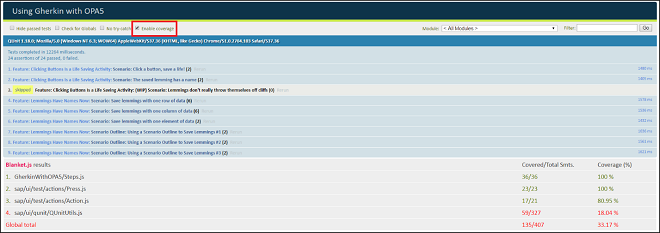

<!-- loio20737a4c64f448d2af9b9745fbe5d762 -->

| loio |
| -----|
| 20737a4c64f448d2af9b9745fbe5d762 |

<div id="loio">

view on: [demo kit nightly build](https://sdk.openui5.org/nightly/#/topic/20737a4c64f448d2af9b9745fbe5d762) | [demo kit latest release](https://sdk.openui5.org/topic/20737a4c64f448d2af9b9745fbe5d762)</div>

## Code Coverage

It can be handy to calculate the code coverage of your integration tests, for example, to figure out whether you forgot to test something or to provide statistics on your test quality.

At test execution time, Gherkin offers the option *Enable coverage* at the top left of the test results. Enabling the option reruns the tests and then lists the files that were tested at the bottom of the page.

  

Gherkin calculates code coverage for any JavaScript file that is loaded after the test harness. This may cause some system libraries to appear in the results. You can specify which files to calculate code coverage for by adding code to your HTML bootstrap file \(after loading OpenUI5, but before running your tests\), as follows.

***

<a name="loio20737a4c64f448d2af9b9745fbe5d762__section_ojq_zz4_fwb"/>

### Istanbul

Code coverage with `Istanbul` relies on a [UI5 server](https://sap.github.io/ui5-tooling/stable/pages/Server/) and [UI5 Middleware Instrumentation](https://github.com/SAP/ui5-tooling-extensions/tree/main/packages/ui5-middleware-instrumentation).

It is integrated into OpenUI5, but if you use UI5 Tooling's `ui5 serve`, you'd need to enable it in `ui5.yaml` and `package.json` of your project.

```html
<script
  src="path/to/resources/sap/ui/qunit/qunit-coverage-istanbul.js"
  data-sap-ui-cover-only="GherkinWithOPA5/"
  data-sap-ui-cover-never="sap/ui/">
</script>
```

For more information, see the [documentation](https://github.com/SAP/ui5-tooling-extensions/tree/main/packages/ui5-middleware-instrumentation).

***

<a name="loio20737a4c64f448d2af9b9745fbe5d762__section_k3n_wz4_fwb"/>

### Blanket.js \(Legacy\)

```html
<script
  src="path/to/resources/sap/ui/qunit/qunit-coverage.js"
  data-sap-ui-cover-only="GherkinWithOPA5/"
  data-sap-ui-cover-never="sap/ui/">
</script>
```

For more information, see the documentation for Blanket.js on GitHub. Keep in mind that the attribute name is slightly different in the OpenUI5 implementation \(`data-sap-ui-cover-only` instead of `data-cover-only`\).

**Related Information**  


[`Blanket.js` Documentation on GitHub](https://github.com/alex-seville/blanket/blob/master/docs/intermediate_browser.md)

[`UI5 Middleware Instrumentation` repo on GitHub](https://github.com/SAP/ui5-tooling-extensions/tree/main/packages/ui5-middleware-instrumentation)

[Code Coverage Measurement](Code_Coverage_Measurement_7ef3242.md "You can measure the code coverage for your test inside the Control.qunit.html page either via HTML or JavaScript code using a code coverage tool like Istanbul (default) or Blanket.js (legacy).")

