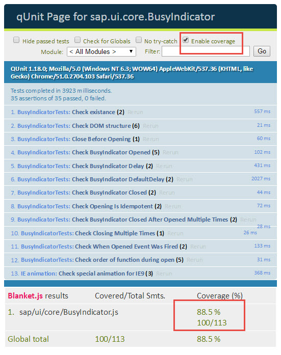

<!-- loio7ef32428dc7c4c048a8d7e8de0a556fb -->

| loio |
| -----|
| 7ef32428dc7c4c048a8d7e8de0a556fb |

<div id="loio">

view on: [demo kit nightly build](https://openui5nightly.hana.ondemand.com/#/topic/7ef32428dc7c4c048a8d7e8de0a556fb) | [demo kit latest release](https://openui5.hana.ondemand.com/#/topic/7ef32428dc7c4c048a8d7e8de0a556fb)</div>

## Code Coverage Measurement

You can measure the code coverage for your test inside the `Control.qunit.html` page either via HTML or JavaScript code using `Blanket.js`.

***

### HTML

With the following line you enable `Blanket.js` to measure the code coverage:

```html
<script type="text/javascript" src="../../../../../resources/sap/ui/qunit/qunit-coverage.js"></script>
```

With this argument, all files that are executed during the test run are added to the result.

If you want to limit the test run, you can use the following code:

-   Limit test to a single file:

    ```html
    <script type="text/javascript" src="../../../../../resources/sap/ui/qunit/qunit-coverage.js"
    	data-sap-ui-cover-only="sap/ui/core/Popup.js"
    ></script>
    ```

-   Limit test to multiple files \(provide an array with comma-separated sources that should occur in the result\):

    ```html
    <script type="text/javascript" src="../../../../../resources/sap/ui/qunit/qunit-coverage.js"
    	data-sap-ui-cover-only="[sap/ui/core/Popup.js, sap/ui/core/EventProvider]"
    ></script>
    ```

-   Limit test to a specific library:

    ```html
    <script type="text/javascript" src="../../../../../resources/sap/ui/qunit/qunit-coverage.js"
    	data-sap-ui-cover-only="sap/ui/core/"
    ></script>
    ```

-   Exclude specific objects:

    ```html
    <script type="text/javascript" src="../../../../../resources/sap/ui/qunit/qunit-coverage.js"
    	data-sap-ui-cover-never="sap/m/"
    ></script>
    ```


***

### JavaScript

Inside your test page, you can add these lines before running the tests:

```js
sap.ui.require(["sap/ui/qunit/qunit-coverage"], function(/*coverage*/){
    // code
});
```

If you want to limit the test run, you can use the following code:

-   Limit test to a single file:

    ```html
    if (window.blanket) {
    	blanket.options("sap-ui-cover-only", "sap/ui/core/Popup.js");
    }
    ```

-   Limit test to multiple files \(provide an array with comma-separated sources that should occur in the result\):

    ```html
    if (window.blanket) {
    	blanket.options("sap-ui-cover-only", "[sap/ui/core/Popup.js, sap/ui/core/EventProvide]");
    }
    ```

-   Limit test to a specific library:

    ```html
    if (window.blanket) {
    	blanket.options("sap-ui-cover-only", "sap/ui/core/");
    }
    ```

-   Exclude specific objects:

    ```html
    if (window.blanket) {
    	blanket.options("sap-ui-cover-never", "sap/ui/example/thirdparty/");
    }
    ```


***

### Results

To view the results of the measurement, select the *Enable coverage* checkbox on the test page. This will trigger a new test run.

In this example the coverage is limited to one specific file - the only one that is important for this test.

  

**Related Information**  


[More information about `Blanket.js`](https://github.com/alex-seville/blanket/blob/master/docs/intermediate_browser.md)

