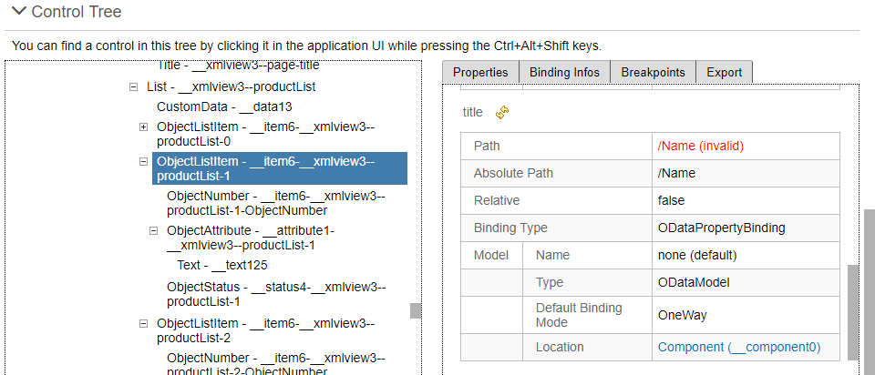
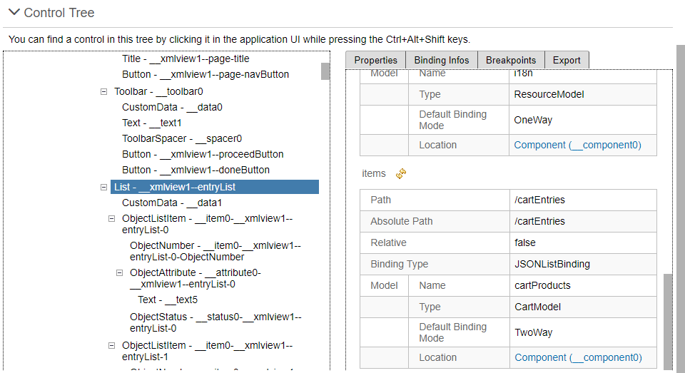
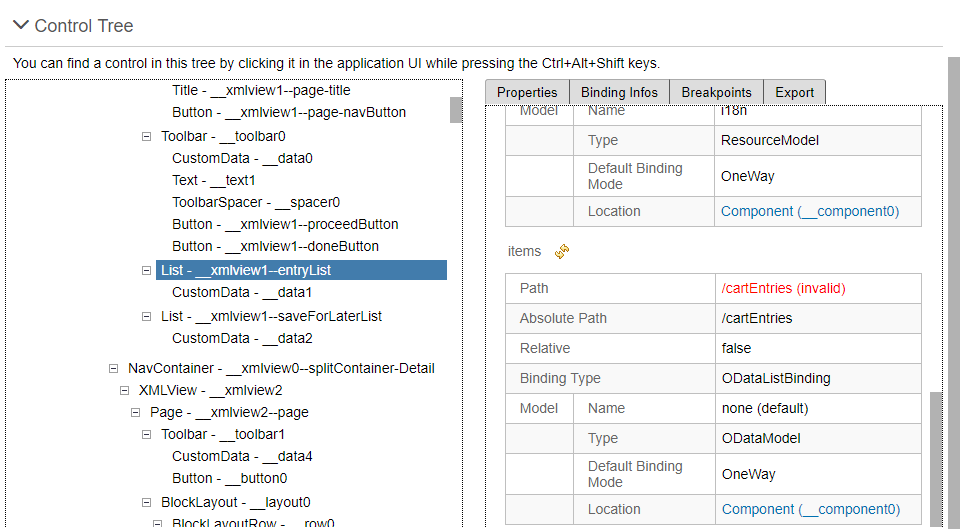

<!-- loio492d9d93effd4229a5a89cb20124553c -->

| loio |
| -----|
| 492d9d93effd4229a5a89cb20124553c |

view on: [demo kit nightly build](https://sdk.openui5.org/nightly/#/topic/492d9d93effd4229a5a89cb20124553c) | [demo kit latest release](https://sdk.openui5.org/topic/492d9d93effd4229a5a89cb20124553c)

## Content or Control Is Not Visible

You find yourself in the situation that a control or the content of a control is not visible, but you don't see an error message in the console.

***

<a name="loio492d9d93effd4229a5a89cb20124553c__section_mng_k2v_tz"/>

### Root Cause

This can happen for one of the following reasons:

-   The element is not properly bound

-   The `visible` property is set to `false`

-   The `height` or `width` dimension is set to `0`

-   The model has been set on the Core

***

<a name="loio492d9d93effd4229a5a89cb20124553c__section_edr_n2v_tz"/>

### Resolution

First, you should check if your control was rendered properly by using the developer tool of your browser to check the DOM element. For information about how to use your browser tools, see the documentation of you browser or check our [Troubleshooting Tutorial Step 1: Browser Developer Tools](Step_1_Browser_Developer_Tools_eadd60a.md).

***

#### Wrong binding

If you bound your control to a source, for example, an image control, the binding may not be resolved properly. This can be caused by minor mistakes such as typos. We recommend using *Diagnostics* to debug your bindings. For more information, see [Diagnostics](Diagnostics_6ec18e8.md#loio6ec18e80b0ce47f290bc2645b0cc86e6).

In the *Diagnostics* window, you can check whether you used a relative binding instead of an absolute one or vice versa.

If you, for example, use a `List` control, you bind the list itself to an absolute path like `items="{/Products}"` whereas the aggregations are bound to a relative path like `title="{Name}"`. The actual path of the `title` property is now `{/Products/*Product_Index*/Name}`.

If you used an absolute binding path like `title="{/Name}` for an aggregation instead of a relative one, the result in the window would look like this:

  

Another common error related to binding is to refer to the default model instead of referring to a specific model. This happens, for examples, if you forgot to add the model name to the binding declaration.

For example, you have two models in your application: the default model, which has no name and another model named `cartProducts`. To bind to the `cartProducts` model you have to write the model name explicitly like `items="{cartProducts>/cartEntries}"`.

If you used the binding correctly *Diagnostics* displays the following:

  

If the model name is missing, you see the following:

  

***

#### `visible` property set to `false`

If you set the `visible` property of a control to `false`, it will not be rendered at all.

Nested controls inherit the value of the `visible` property from their parents. Therefore, if the control that you are missing is nested in a parent control that is set to invisible, the nested control will also not be rendered.

You can fix this by setting the `visible` property of the parent control to `true` or by moving your missing control in the XML view so that it is not longer nested inside an invisible control.

***

#### Dimensions set to `0`

Most controls have the properties `width` and `height`. If one of them is explicitly set to `0` some controls may not be displayed at all. Similar to the `visible` property, the value of `width` and `height` are also inherited from parent controls, as long as you don't set an explicit value for these dimensions. If you, for example, set one of the dimension values for a control to `100%` it will have the same size as the parent control. And if the parent's width is `0` the nested control will also be `0`.

As with the `visible` property, you can solve this by either increasing the size of the parent or setting fixed values for the child \(for example, `100px`\) instead of a relative value.

***

#### Model set on the Core

Avoid setting models directly on the Core if you're using Components. Components are meant to be independent and reusable parts and therefore will not inherit the Core models by default.

Models should be set depending on your use case:

-   Models defined in the app descriptor \(manifest.json\) will be set on the Component. They are automatically propagated to its descendants.
-   Only set models on certain controls \(e.g. View, Panel, etc.\) if the data are not needed elsewhere.
-   Only set models on the Core if the app is **not** Component-based.

Register models on the root Component or on single views of your apps.

**Example:** `this.getView().setModel("myModel", aModel);` Do **not** use `sap.ui.getCore()` to register models.

> ### Tip:  
> To get the Component that owns an embedded view, you can use the following line of code in the view controller:
> 
> `sap.ui.core.Component.getOwnerComponentFor(this.getView());`

