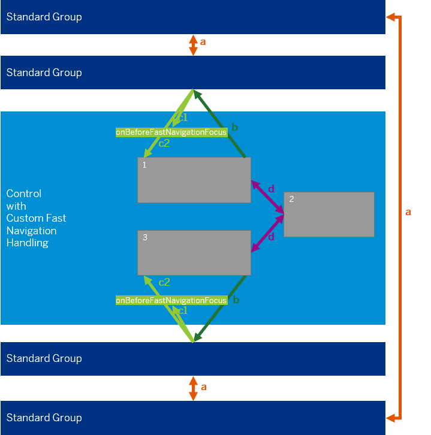

<!-- loio10b14c7284ba48a185ae2046db470706 -->

| loio |
| -----|
| 10b14c7284ba48a185ae2046db470706 |

<div id="loio">

view on: [demo kit nightly build](https://sdk.openui5.org/nightly/#/topic/10b14c7284ba48a185ae2046db470706) | [demo kit latest release](https://sdk.openui5.org/topic/10b14c7284ba48a185ae2046db470706)</div>

## Defining Groups for Fast Navigation

Adjacent controls within the tab chain can be grouped. Within such a group, [F6\] or  [Ctrl\] + [Alt/Option\] + [Down\] skip all controls of the group and move the focus to the first control in the tab chain of the next group.  [Shift\] + [F6\]  or  [Ctrl\] + [Alt/Option\] + [Up\]  move the focus to the first control of the previous group. Adjacent tab chain elements between groups are automatically handled as one group. For nested groups, the most concrete group is used.

Basically, a fast navigation group is defined via the attribute `data-sap-ui-fastnavgroup="true"` on a DOM element. Several options exist to implement fast navigation support in controls.

> ### Note:  
> We recommend that you do **not** provide fast navigation support for small controls such as `Button` or `InputField`. The fast navigation feature is intended for large, more complex controls containing multiple "tab-able" elements to enable the user to quickly jump over controls if needed.

***

### Defining a Fast Navigation Group on Control or Element Root Level

This is the preferred option and can be used for many use cases. If a control or an element with a DOM representation wants to define a fast navigation group on its root element, use the `CustomData` mechanism in the `init` function of the control or element to set the attribute.

```js
init = function(){
  //...
  this.data("sap-ui-fastnavgroup", "true", true/*Write into DOM*/);
  //...
};

```

The `RenderManager` writes the attribute automatically during rendering when the `openStart` method is called \(new rendering API\) or when the `writeControlData` or `writeElementData` is called \(legacy rendering API\). The application can also change the custom data if desired.

***

### Defining a Fast Navigation Group Within a Control

During rendering of a control, the attribute can also be written to any arbitrary DOM element of the control.

```js

// assuming a renderer that uses the new rendering API
render = function(oRm, oControl){
  //...
  oRm.attr("data-sap-ui-fastnavgroup", "true");
  //...
};

```

> ### Note:  
> In this case it is difficult for an application to adapt the behavior.

***

### Custom Fast Navigation Handling

It may be necessary that a control has to provide a custom fast navigation handling, for example, if the DOM structure of the control does not allow to define suitable navigation groups with one of the options described above. The following picture shows how the central fast navigation handling \(a\) outside the control collaborates with the custom handling inside the control.

  

To implement custom fast navigation handling, start with flagging the control as a custom handling area:

```js
render = function(oRm, oControl){
  //...
  oRm.openStart("div", oControl);
  oRm.attr("data-sap-ui-customfastnavgroup", "true"); //Attribute must be on the root element of the control.
  //...
};

```

To implement the custom fast navigation behavior within the control \(d\), use the event handlers `onsapskipforward` \([F6\] or  [Ctrl\] + [Alt/Option\] + [Down\] \) and `onsapskipback` \( [Shift\] + [F6\]  or  [Ctrl\] + [Alt/Option\] + [Up\] \). When `preventDefault` is called on the provided event, the central fast navigation handling ignores the event.

The interesting point is the collaboration \(b, c\) between the control and the central fast navigation handling.

```js
onsapskipforward = function(oEvent){ //F6
  var oTarget = findNextDomRefToFocus(oEvent.target); //Search for the next DOM element within the control which should be focused.
  if(!oTarget){
    //target is in the last group -> focus should jump to the first group after the control (done by the central handling, preventDefault not called)
  }else{
    oEvent.preventDefault();
    oTarget.focus();
  }
};

onsapskipback = function(oEvent){ //Shift+F6
  var oTarget = findPreviousDomRefToFocus(oEvent.target); //Search for the previous DOM element within the control which should be focused.
  if (!oTarget) {
    //target is in the first group -> focus should jump to the first group before the control (done by the central handling, preventDefault not called)
  } else {
    oEvent.preventDefault();
    oTarget.focus();
  }
};

```

If the focus resides within the control and jumps out of the control \(b\) when pressing [F6\] or  [Shift\] + [F6\]  \(or the alternative key combinations given above\), the `onsapskipforward` and `onsapskipback` events should not be handled \(no `preventDefault` call\).

If the focus resides outside the control and the central fast navigation handling calculates a target to focus within the control, the central handling first calls the event handler `onBeforeFastNavigationFocus` \(if available\) on the control \(c1, c2\) that is flagged as a custom handling area. The provided event has the following attributes:

-   `target`: Specifies the DOM element that the central handling tries to focus within the custom handling area

-   `source`: Specifies the DOM element which is the starting point for the calculation of the next/previous element to focus; this is usually the element that is currently focused

-   `forward`: Specifies whether forward \([F6\] or  [Ctrl\] + [Alt/Option\] + [Down\] \) or backward \( [Shift\] + [F6\]  or  [Ctrl\] + [Alt/Option\] + [Up\] \) navigation is used


If `preventDefault` is called on `BeforeFastNavigationFocus`, setting the focus on the target by the central handling is skipped.

```js
onBeforeFastNavigationFocus = function(oEvent) {
  var oTarget;
  if (jQuery.contains(this.getDomRef(), oEvent.source)) {
    //The source is within the custom area (e.g. might happen when the focus is on a popup which is attached to an element within the custom area)
    oTarget = oEvent.forward ? findNextDomRefToFocus(oEvent.source) : findPreviousDomRefToFocus(oEvent.source);
  } else {
    //The source is outside of the custom area
    oTarget = oEvent.forward ? findFirstDomRefToFocus() : findLastDomRefToFocus();
  }
  if (oTarget) {
    oEvent.preventDefault();
    oTarget.focus();
  }
};

```

**Related Information**  


[Fast Navigation](Fast_Navigation_d23e2cf.md "Adjacent controls within the tab chain can be grouped for fast navigation using keyboard shortcuts.")

