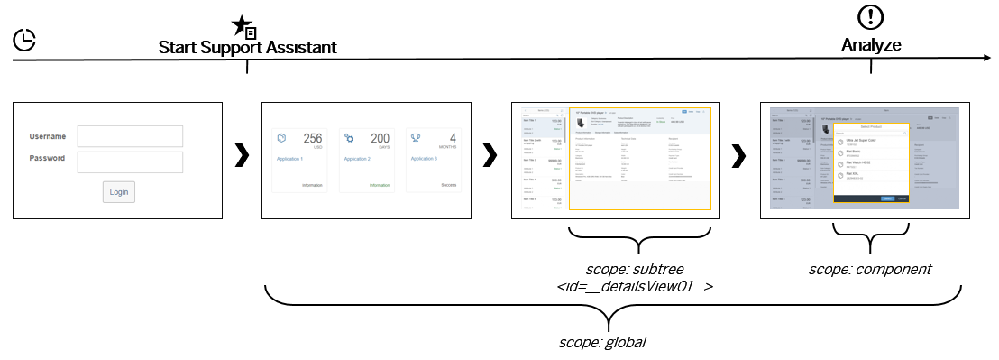

<!-- loioe15067d976f24b11907f4c262bd749a0 -->

| loio |
| -----|
| e15067d976f24b11907f4c262bd749a0 |

view on: [demo kit nightly build](https://openui5nightly.hana.ondemand.com/#/topic/e15067d976f24b11907f4c262bd749a0) | [demo kit latest release](https://openui5.hana.ondemand.com/#/topic/e15067d976f24b11907f4c262bd749a0)

## Execution Scope

OpenUI5 apps consist of multiple views, components and fragments. If you run the rules on the complete app with all loaded elements and components, you may not get the desired results. Therefore, the Support Assistant allows you to change the scope of an analysis run and thus narrow down your result set. This helps you focus on specific issues, components or controls within your app.

***

### Execution Scopes

To change the analysis scope, select the gears icon next to the *Analyze* button.

   
  
<a name="loioe15067d976f24b11907f4c262bd749a0__fig_nxt_bzy_n1b"/>Support Assistant - Execution Scopes

  

There are three available execution scopes:

-   *Global* - The rules are executed on the whole application, including all loaded components, elements and previously opened pages.

-   *Sub-tree* - The rules are executed on the specified subtree root element and all its subelements \(which are not components themselves\).

-   *Component\(s\)* - The rules are executed on the specified set of loaded components/fragments.

> ### Note:  
> The scoping information will also be taken into account when generating the analysis report.

