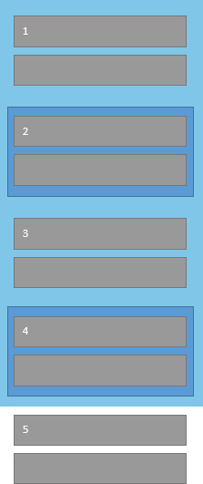

<!-- loiod23e2cf618a44382a203691e8a0baef4 -->

| loio |
| -----|
| d23e2cf618a44382a203691e8a0baef4 |

<div id="loio">

view on: [demo kit nightly build](https://sdk.openui5.org/nightly/#/topic/d23e2cf618a44382a203691e8a0baef4) | [demo kit latest release](https://sdk.openui5.org/topic/d23e2cf618a44382a203691e8a0baef4)</div>

## Fast Navigation

Adjacent controls within the tab chain can be grouped for fast navigation using keyboard shortcuts.

***

<a name="loiod23e2cf618a44382a203691e8a0baef4__section_c3v_jlx_kwb"/>

### Fast Navigation for Adjacent Groups

When the focus is on a control within a group and the user presses [F6\] or  [Ctrl\] + [Alt/Option\] + [Down\] , all remaining controls within the group are skipped, and the focus moves to the first control of the next adjacent group.

***

<a name="loiod23e2cf618a44382a203691e8a0baef4__section_ulv_qlx_kwb"/>

### Fast Navigation for Nested Groups

Groups for fast navigation can also be nested. If the user presses the shortcut from within a nested group, the focus keeps moving along the tab chain until a control is reached that belongs to a different group. If, for example, no other adjacent nested group exists, the focus moves up to that control in the superordinate \(parent\) group which follows the nested group. In this case, other controls than the first control in a group could be in focus as well.

***

<a name="loiod23e2cf618a44382a203691e8a0baef4__section_s1z_slx_kwb"/>

### Backward Fast Navigation

 [Shift\] + [F6\]  or  [Ctrl\] + [Alt/Option\] + [Up\]  move the focus back to a control of the previous group. The same constraints apply as for the forward navigation.

***

<a name="loiod23e2cf618a44382a203691e8a0baef4__section_mwt_vlx_kwb"/>

### Example: Fast Navigation With Nested Groups

The following image describes this behavior. Groups are highlighted in blue, elements in the tab chain are grey.


<table>
<tr>
<th valign="top">

Fast Navigation Step


</th>
<th valign="top">

Description


</th>
</tr>
<tr>
<td valign="top">

0


</td>
<td valign="top">

The focus is on Control 1, which is the first control in the tab chain of the first group.


</td>
</tr>
<tr>
<td valign="top">

i


</td>
<td valign="top">

The focus moves to Control 2, which is the next control in the tab chain belonging to a different group \(in this case, a group nested within the previous group\).


</td>
</tr>
<tr>
<td valign="top">

ii


</td>
<td valign="top">

The focus moves to Control 3, which is the next control in the tab chain belonging to a different group. Since the focus moves back up from the nested group to the original group, Control 3 is in the same group as Control 1 focused previously.


</td>
</tr>
<tr>
<td valign="top">

iii


</td>
<td valign="top">

The focus moves to Control 4, which is the next control in the tab chain belonging to a different group \(another group nested within the previous group\).


</td>
</tr>
<tr>
<td valign="top">

iv


</td>
<td valign="top">

The focus is moved to the next control in the tab chain belonging to a different group. Because all adjacent controls not belonging to any group form their own group, Control 5, which is the first control in the tab chain of this group, is focused.


</td>
</tr>
<tr>
<td valign="top">

v


</td>
<td valign="top">

A search for the next control to focus on reaches the end of the tab chain and starts over from the beginning. Now Control 1 has the focus again.


</td>
</tr>
</table>

 

***

The fast navigation cycles. This means if the focus is within the last group in the group chain, the focus moves to the first control in the first group. This leads to an additional fast navigation chain, which allows fast navigation through applications. Larger controls like the `Table`, `Panel`, and `Form` provide their own groups by default. The application developer defines further groups.

As described, some larger controls or containers already define fast navigation groups. If a group is defined on root level of a control or element, the group can be removed by using the `CustomData` mechanism.

Coding Example:

```js
oControl.data("sap-ui-fastnavgroup", "false", true/*Write into DOM*/);
```

XML View Example:

```xml
<mvc:View
  xmlns:core="sap.ui.core"
  xmlns:mvc="sap.ui.core.mvc"
  xmlns="sap.m">
  <Panel>
    <headerToolbar>
      <Toolbar>
        <Button icon="sap-icon://settings" />
      </Toolbar>
    </headerToolbar>
    <content>
      <Text text="Lorem ipsum dolor st amet..." />
    </content>
    <customData>
      <core:CustomData key="sap-ui-fastnavgroup" value="false" writeToDom="true" />
    </customData>
  </Panel>
</mvc:View>

```

In the same way it is possible to make a control or element to be a fast navigation group. However, keep in mind that not all elements are represented in the DOM.

Coding Example:

```js
oControl.data("sap-ui-fastnavgroup", "true", true/*Write into DOM*/);
```

XML View Example:

```xml
<mvc:View
  xmlns:core="sap.ui.core"
  xmlns:mvc="sap.ui.core.mvc"
  xmlns="sap.m">
  <Panel>
    <headerToolbar>
      <Toolbar>
        <Button icon="sap-icon://settings" />
      </Toolbar>
    </headerToolbar>
    <content>
      <Text text="Lorem ipsum dolor st amet..." />
    </content>
    <customData>
      <core:CustomData key="sap-ui-fastnavgroup" value="true" writeToDom="true" />
    </customData>
  </Panel>
</mvc:View>

```

Also, DOM elements that are not controlled by OpenUI5 controls can be grouped by setting `data-sap-ui-fastnavgroup="true"`.

