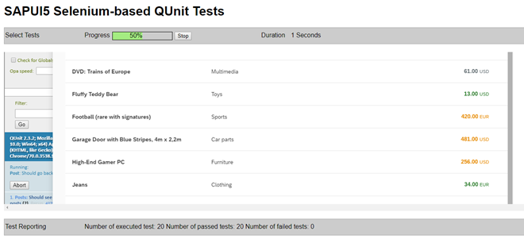

<!-- loio07c97a2e497d443eb6fa74bb9445ab9c -->

| loio |
| -----|
| 07c97a2e497d443eb6fa74bb9445ab9c |

<div id="loio">

view on: [demo kit nightly build](https://openui5nightly.hana.ondemand.com/#/topic/07c97a2e497d443eb6fa74bb9445ab9c) | [demo kit latest release](https://openui5.hana.ondemand.com/#/topic/07c97a2e497d443eb6fa74bb9445ab9c)</div>

## Step 10: Test Suite and Automated Testing

In this step, we will step back from our tests and application features that we have implemented so far and add another important piece of test code: The test suite page. A test suite can execute multiple tests and collect the results. This comes in handy for automatic tools in a continuous integration process.

***

### Preview

   
  
<a name="loio07c97a2e497d443eb6fa74bb9445ab9c__fig_r1j_pst_mr"/>A Selenium runner for the test suite of the bulletin board

  

***

### Coding

You can view and download all files in the *Samples* in the Demo Kit at [Testing - Step 10](https://openui5.hana.ondemand.com/explored.html#/sample/sap.m.tutorial.testing.10/preview).

***

<a name="loio07c97a2e497d443eb6fa74bb9445ab9c__section_uzv_wh5_xfb"/>

### webapp/test/testsuite.qunit.html \(New\)

```html
<!DOCTYPE HTML>
<html>
<head>
	<title>QUnit test suite for Bulletin Board</title>
	<script src="resources/sap/ui/qunit/qunit-redirect.js"></script>
	<script src="testsuite.qunit.js" data-sap-ui-testsuite></script>
</head>
<body>
</body>
</html>

```

Create a new `testsuite.qunit.html` file. Here, you add the `testsuite.qunit.js` script, which we will define next, as a source.

***

### webapp/test/testsuite.qunit.js \(New\)

```js
window.suite = function() {
	"use strict";

	var oSuite = new parent.jsUnitTestSuite(),
		sContextPath = location.pathname.substring(0, location.pathname.lastIndexOf("/") + 1);

	oSuite.addTestPage(sContextPath + "unit/unitTests.qunit.html");
	oSuite.addTestPage(sContextPath + "integration/opaTests.qunit.html");

	return oSuite;
};
```

This new `testsuite.qunit.js` file contains the logic for the QUnit tests. The coding is quite straightforward: We require the relevant QUnit files for redirecting to the central test suite and provide a configuration function `suite()` that is called automatically by the testrunner.

Inside this function, we add the QUnit pages for the app’s unit and integration tests. For technical reasons, we have to provide an absolute path to the HTML pages so that the testrunner can execute them centrally. You can now run the `webapp/test/testsuite.qunit.html` file to check if all unit and integration tests are running fine with one URL.

> ### Note:  
> A similar test suite can be configured as a pre-commit hook in local build environments or as a pre-submit hook in a continuous integration scenario on the central build server. Only when all tests run successfully, a new change is accepted and may be merged.
> 
> Alternatively you can use a local test runner, such as Selenium or Karma, that automatically executes all tests whenever a file in the app project has been changed. All of these configurations run the tests and collect the resulting messages for further analysis. Therefore, it is very important to define meaningful test descriptions and success as well as error messages as you write your application tests.

***

### Conventions

-   Create a test suite app that triggers all your tests at once

-   Run the test suite whenever you change the code of the app


**Parent topic:** [Testing](Testing_291c912.md "In this tutorial we will test application functionality with the testing tools that are delivered with OpenUI5. At different steps of this tutorial you will write tests using QUnit, OPA5, and the OData V2 mock server. Additionally, you will learn about testing strategies, Test Driven Development (TDD), and much more.")

**Next:** [Step 9: Adding the Post Page](Step_9_Adding_the_Post_Page_4a9f063.md "Now that we have covered all kinds of tests for navigation, we introduce our Post page that shows details of a post in the bulletin board. To achieve this, we have to introduce a new view/controller pair and adjust the routing of the application.")

**Previous:** [Step 11: Testing User Input](Step_11_Testing_User_Input_92959b1.md "In this step, we will write a test that simulates a user search. We will enter the search string into the search field and check if the correct results are shown in worklist table.")

**Related Information**  


[*Karma* Home Page](https://www.npmjs.com/package/karma)

[*Selenium* Home Page](http://docs.seleniumhq.org/)

[Test Automation](Test_Automation_ae44824.md#loioae448243822448d8ba04b4784f4b09a0 "To make sure that the code is always tested thoroughly before it is included in a productive app, you should use a test runner that automates tests. The test runner can be included in your project setup so that it is called whenever code changes are submitted.")

