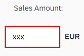

<!-- loiob8c4e534cdb440e9a5bbff86f9572bd6 -->

| loio |
| -----|
| b8c4e534cdb440e9a5bbff86f9572bd6 |

<div id="loio">

view on: [demo kit nightly build](https://openui5nightly.hana.ondemand.com/#/topic/b8c4e534cdb440e9a5bbff86f9572bd6) | [demo kit latest release](https://openui5.hana.ondemand.com/#/topic/b8c4e534cdb440e9a5bbff86f9572bd6)</div>

## Step 11: Validation Using the Message Manager

So far, we have created a currency field that can format itself correctly. The currency data type also has the ability to validate that user input adheres to to the requirements of a currency; however, data type validation functions are managed by OpenUI5, which of itself has no mechanism for reporting error messages back to the UI; therefore, we need a mechanism for reporting error messages raised by validation functions back to the user. In this step, we will connect the entire view to a feature known as the "Message Manager". Once this connection is established, any validation error messages generated based on the user input will be passed to the message manager which in turn will connect them to the appropriate view and control that caused the error.

***

### Preview

   
  
<a name="loiob8c4e534cdb440e9a5bbff86f9572bd6__fig_r1j_pst_mr"/>A message appears

  

***

### Coding

You can view and download all files in the Demo Kit at [Data Binding - Step 11](https://openui5.hana.ondemand.com/explored.html#/sample/sap.ui.core.tutorial.databinding.11/preview).

***

### webapp/index.js

```js
sap.ui.require([
	"sap/ui/model/json/JSONModel",
	"sap/ui/core/mvc/XMLView",
	"sap/ui/model/resource/ResourceModel"
], function (JSONModel, XMLView, ResourceModel) {
	"use strict";

	// Attach an anonymous function to the SAPUI5 'init' event
	sap.ui.getCore().attachInit(function () {
		var oModel = new JSONModel({
			firstName: "Harry",
			lastName: "Hawk",
			enabled: true,
			address: {
				street: "Dietmar-Hopp-Allee 16",
				city: "Walldorf",
				zip: "69190",
				country: "Germany"
			},
			salesAmount: 12345.6789,
			currencyCode: "EUR"
		});

		// Assign the model object to the SAPUI5 core
		sap.ui.getCore().setModel(oModel);

		var oResourceBundle = new ResourceModel({
			bundleName: "sap.ui.demo.db.i18n.i18n",
			supportedLocales: ["", "de"],
			fallbackLocale: ""			
		});

		sap.ui.getCore().setModel(oResourceModel, "i18n");

		// Display the XML view called "App"
		var oView = new XMLView({
			viewName: "sap.ui.demo.db.view.App"
		});

		// Register the view with the message manager
		sap.ui.getCore().getMessageManager().registerObject(oView, true);


		// Insert the view into the DOM
		oView.placeAt("content");
	});
});

```

The changes to the coding are minimal:

-   The XML view is now created as a named object called `oView`.

-   The view object `oView` is registered with the `MessageManager`.

-   Once registered, the XML view is then inserted into the DOM as before.


You can now enter a non-numeric value into the *Sales Amount* field and either press [Enter\] or move the focus to a different UI control. This action triggers either the `onenter` or `onchange` event and then OpenUI5 executes the validation function belonging to the `sap.ui.model.type.Currency` data type.

Now that the view has been registered with the `MessageManager`, any validation error messages will be picked up by the `MessageManager`, which in turn checks its list of registered objects and then passes the error message back to the correct view for display.

Note that the field in error has a red border:  

However, the error message itself will only be displayed when that particular field has focus: 

**Parent topic:** [Data Binding](Data_Binding_e531093.md "In this tutorial, we will explain the concepts of data binding in OpenUI5.")

**Next:** [Step 10: Property Formatting Using Data Types](Step_10_Property_Formatting_Using_Data_Types_9252ee4.md "OpenUI5 provides a set of simple data types such as Boolean, Currency, Date and Float. These data types can then be applied to controls in order to ensure that the value presented on the screen is formatted correctly, and, if the field is open for input, that the value entered by the user adheres to the requirements of that data type. We will now add a new field called Sales Amount of type Currency.")

**Previous:** [Step 12: Aggregation Binding Using Templates](Step_12_Aggregation_Binding_Using_Templates_97830de.md "Aggregation binding (or &quot;list binding&quot;) allows a control to be bound to a list within the model data and allows relative binding to the list entries by its child controls.")

**Related Information**  


[Error, Warning, and Info Messages](Error_Warning_and_Info_Messages_62b1481.md "OpenUI5 provides a central place for storing and managing info, warning, and error messages.")

