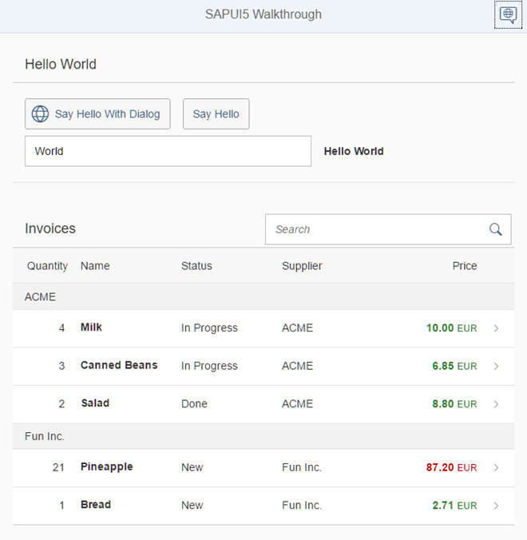

<!-- loioa96e18b4cd924196b255eb9623431dbb -->

| loio |
| -----|
| a96e18b4cd924196b255eb9623431dbb |

<div id="loio">

view on: [demo kit nightly build](https://openui5nightly.hana.ondemand.com/topic/a96e18b4cd924196b255eb9623431dbb) | [demo kit latest release](https://sdk.openui5.org/topic/a96e18b4cd924196b255eb9623431dbb)</div>

## Step 34: Responsiveness

In this step, we improve the responsiveness of our app. OpenUI5 applications can be run on phone, tablet, and desktop devices and we can configure the application to make best use of the screen estate for each scenario. Fortunately, OpenUI5 controls like the `sap.m.Table` already deliver a lot of features that we can use.

***

### Preview

   
  
<a name="loioa96e18b4cd924196b255eb9623431dbb__fig_r1j_pst_mr"/>A responsive table is hiding some of the columns on small devices

  

***

### Coding

You can view and download all files at [Walkthrough - Step 34](https://sdk.openui5.org/explored.html#/sample/sap.m.tutorial.walkthrough.34/preview).

```xml
<mvc:View
		controllerName="sap.ui.demo.walkthrough.controller.InvoiceList"
		xmlns="sap.m"
		xmlns:mvc="sap.ui.core.mvc">
	<Table
		id="invoiceList"
		class="sapUiResponsiveMargin"
		width="auto"
		items="{
			path : 'invoice>/Invoices',
			sorter : {
				path : 'ShipperName',
				group : true
			}
		}">
		<headerToolbar>
			<Toolbar>
				<Title text="{i18n>invoiceListTitle}"/>
				<ToolbarSpacer/>
				<SearchField width="50%" search=".onFilterInvoices"/>
			</Toolbar>
		</headerToolbar>
		<columns>
			<Column
				hAlign="End"
				minScreenWidth="Small"
				demandPopin="true"
				width="4em">
				<Text text="{i18n>columnQuantity}"/>
			</Column>
			<Column>
				<Text text="{i18n>columnName}"/>
			</Column>
			<Column
				minScreenWidth="Small"
				demandPopin="true">
				<Text text="{i18n>columnStatus}"/>
			</Column>
			<Column
				minScreenWidth="Tablet"
				demandPopin="false">
				<Text text="{i18n>columnSupplier}"/>
			</Column>
			<Column
				hAlign="End">
				<Text text="{i18n>columnPrice}"/>
			</Column>
		</columns>
		<items>
			<ColumnListItem
				type="Navigation"
				press=".onPress">
				<cells>
					<ObjectNumber number="{invoice>Quantity}" emphasized="false"/>
					<ObjectIdentifier title="{invoice>ProductName}"/>
					<Text text="{
						path: 'invoice>Status',
						formatter: '.formatter.statusText'
					}"/>
					<Text text="{invoice>ShipperName}"/>
					<ObjectNumber
						number="{
							parts: [{path: 'invoice>ExtendedPrice'}, {path: 'view>/currency'}],
							type: 'sap.ui.model.type.Currency',
							formatOptions: {
								showMeasure: false
							}
						}"
						unit="{view>/currency}"
						state="{= ${invoice>ExtendedPrice} > 50 ? 'Error' : 'Success' }"/>
				</cells>
			</ColumnListItem>
		</items>
	</Table>

</mvc:View>
```

We exchange the list with a table simply by replacing the tag `<List>` with `<Table>`. The table has a built-in responsiveness feature that allows us to make the app more flexible. The table and the list share the same set of properties so we can simply reuse these and also the sorter.

Since a table has multiple cells in each row, we have to define columns for our table and name these according to the data. We add five `sap.m.Column` controls to the column aggregation and configure each one a bit differently:

-   **Quantity**

    This column will contain a short number, so we set the alignment to `End` \(which means "right" in LTR languages\) and the width to `4em` which is long enough for the column description. As a description text we use a `sap.m.Text` control that references a property of the resource bundle. We set the property `minScreenWidth` to `Small` to indicate that this column is not so important on phones. We will tell the table to display this column below the main column by setting the property `demandPopin` to `true`.

-   **Name**

    Our main column that has a pretty large **width** to show all the details. It will always be displayed.

-   **Status**

    The status is not so important, so we also display it below the `name` field on small screens by setting `minScreenWidth` to `small` and `demandPopin` to `true`

-   **Supplier**

    We completely hide the `Supplier` column on phone devices by setting `minScreenWidth` to `Tablet` and `demandPopin` to `false`.

-   **Price**

    This column is always visible as it contains our invoice price.


Instead of the `ObjectListItem` that we had before, we will now split the information onto the cells that match the columns defined above. Therefore we change it to a `ColumnListItem` control with the same attributes, but now with cells aggregation. Here we create five controls to display our data:

-   **Quantity**

    A simple `sap.m.ObjectNumber` control that is bound to our data field.

-   **Name**

    A `sap.m.ObjectIdentifier` control that specifies the name.

-   **Status**

    A `sap.m.Text control` with the same formatter as before.

-   **Supplier**

    A simple `sap.m.Text` control.

-   **Price**

    An `ObjectNumber` control with the same formatter as the attributes number and `numberUnit` from the previous steps.


Now we have defined our table responsively and can see the results when we decrease the browsers screen size. The *Supplier* column is not shown on phone sizes and the two columns *Quantity* and *Status* will be shown below the name.

***

### webapp/i18n/i18n.properties

```ini
...
# Invoice List
invoiceListTitle=Invoices
invoiceStatusA=New
invoiceStatusB=In Progress
invoiceStatusC=Done
columnQuantity=Quantity
columnName=Name
columnSupplier=Supplier
columnStatus=Status
columnPrice=Price

# Detail Page
...
```

We add the column names and the attribute titles to our `i18n` file.

We can see the results when we decrease the browser's screen size or open the app on a small device.

***

### Conventions

-   Optimize your application for the different screen sizes of phone, tablet, and desktop devices.


**Parent topic:** [Walkthrough](Walkthrough_3da5f4b.md "In this tutorial we will introduce you to all major development paradigms of OpenUI5.")

**Next:** [Step 33: Custom Controls](Step_33_Custom_Controls_d12d2ee.md "In this step, we are going to extend the functionality of OpenUI5 with a custom control. We want to rate the product shown on the detail page, so we create a composition of multiple standard controls using the OpenUI5 extension mechanism and add some glue code to make them work nicely together. This way, we can reuse the control across the app and keep all related functionality in one module.")

**Previous:** [Step 35: Device Adaptation](Step_35_Device_Adaptation_d63a15e.md "We now configure the visibility and properties of controls based on the device that we run the application on. By making use of the sap.ui.Device API and defining a device model we will make the app look great on many devices.")

**Related Information**  


[Configuring Responsive Behavior of a Table](Configuring_Responsive_Behavior_of_a_Table_38855e0.md "OpenUI5 supports column-based and row-based solutions to support flexible and clearly arranged tables.")

