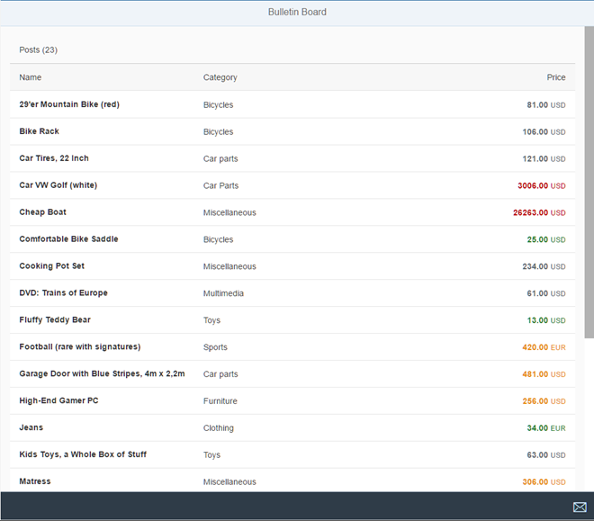

<!-- loio2bf4892527174264808076be32c1e1b0 -->

| loio |
| -----|
| 2bf4892527174264808076be32c1e1b0 |

<div id="loio">

view on: [demo kit nightly build](https://openui5nightly.hana.ondemand.com/topic/2bf4892527174264808076be32c1e1b0) | [demo kit latest release](https://sdk.openui5.org/topic/2bf4892527174264808076be32c1e1b0)</div>

## Step 3: Adding the Price Formatter

We will now take care of the implementation of the price formatter and make sure that the tests we wrote in the previous step run successfully.

If the tests are passed, we can be sure that the formatter is formally correct but it is still not visible in the app. So additionally, we will add the formatter to the UI to be able to verify and check that the price is shown properly.

***

### Preview

   
  
<a name="loio2bf4892527174264808076be32c1e1b0__fig_r1j_pst_mr"/>The price is now formatted with a semantic color

  

***

### Coding

You can view and download all files in the *Samples* in the Demo Kit at [Testing - Step 3](https://sdk.openui5.org/explored.html#/sample/sap.m.tutorial.testing.03/preview).

***

### webapp/model/formatter.js

```js
sap.ui.define([
	"sap/m/Text"
], function (Text) {
	"use strict";
	return {
		numberUnit: function (sValue) {
			…
		},
		/**
		 * Defines a value state based on the price
		 *
		 * @public
		 * @param {number} iPrice the price of a post
		 * @returns {string} sValue the state for the price
		 */
		priceState: function (iPrice) {
			if (iPrice < 50) {
				return "Success";
			} else if (iPrice >= 50 && iPrice < 250) {
				return "None";
			} else if (iPrice >= 250 && iPrice < 2000) {
				return "Warning";
			} else {
				return "Error";
			}
		}
	};
});
```

We change the empty formatter function that we have added in the last step and add the implementation details to it. If the implementation matches the specification embedded in our tests we are done with implementing the formatter.

The input for the formatter is the price value from the model and the result is the state as a `string` value. The actual implementation logic is quite simple and returns a semantic state value based on the price as we have seen already in the test. There are four cases that are reflected in the `if/else` statements inside the formatter.

You can now run the file `webapp/test/unit/unitTests.qunit.html` and check if the unit tests run successfully. You should see your new test cases on the result page. If the overall result is successful then we have successfully implemented our first feature.

***

### webapp/view/Worklist.view.xml

```xml
…
<ColumnListItem vAlign="Middle">
	<cells>
		…
		<ObjectNumber
			number="{
				path: 'Price',
				formatter: '.formatter.numberUnit'
			}"
			state="{
				path: 'Price',
				formatter: '.formatter.priceState'
			}"
			unit="{Currency}"/>
	</cells>
</ColumnListItem>
…
```

We still have to apply the changes to our UI so that we can actually see the formatted price in the app. Unit tests are typically testing the logic independent of the user interface. That is why the tests are running successfully even though we did not adapt the UI yet.

In our worklist view we simply add a state attribute to the `ObjectNumber` control in the `columns` aggregation. We define the same data binding path as for the number, but we use our new formatter function to determine the proper state. If you now run the `webapp/test/mockServer.html` file, you can see that some of the product prices are listed in green, black, orange, and red depending on their price.

**Parent topic:** [Testing](Testing_291c912.md "In this tutorial we will test application functionality with the testing tools that are delivered with OpenUI5. At different steps of this tutorial you will write tests using QUnit, OPA5, and the OData V2 mock server. Additionally, you will learn about testing strategies, Test Driven Development (TDD), and much more.")

**Next:** [Step 2: A First Unit Test](Step_2_A_First_Unit_Test_b81736e.md "In this step we will analyze the unit testing infrastructure and write a first unit test.")

**Previous:** [Step 4: Testing a New Module](Step_4_Testing_a_New_Module_a5bb7a6.md "In the first unit test we have just extended the formatters module with a new function. Now we will write a unit test that will test the functionality of an entirely new module.")

**Related Information**  


[API Reference: `sap.ui.core.ValueState`](https://sdk.openui5.orgdocs/api/symbols/sap.ui.core.ValueState.html)

[API Reference: `sap.m.ObjectNumber`](https://sdk.openui5.orgdocs/api/symbols/sap.m.ObjectNumber.html)

