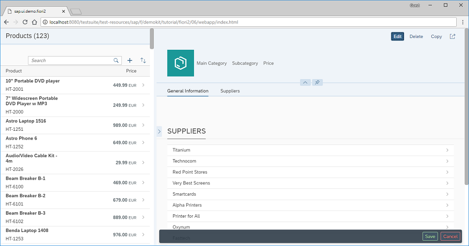

<!-- loio555ed73903b34c70a23ba13af1a5d71e -->

| loio |
| -----|
| 555ed73903b34c70a23ba13af1a5d71e |

<div id="loio">

view on: [demo kit nightly build](https://openui5nightly.hana.ondemand.com/#/topic/555ed73903b34c70a23ba13af1a5d71e) | [demo kit latest release](https://openui5.hana.ondemand.com/#/topic/555ed73903b34c70a23ba13af1a5d71e)</div>

## Step 6: Adding a Floating Footer

In this step, we add a floating footer to the detail page.

***

<a name="loio555ed73903b34c70a23ba13af1a5d71e__section_ed2_4dd_lbb"/>

### Preview

   
  
<a name="loio555ed73903b34c70a23ba13af1a5d71e__fig_r1j_pst_mr"/>`ObjectPageLayout` with a floating footer

  

***

<a name="loio555ed73903b34c70a23ba13af1a5d71e__section_fd2_4dd_lbb"/>

### Coding

You can view and download all files at [Flexible Column Layout App - Step 6](https://openui5.hana.ondemand.com/#/sample/sap.f.tutorial.fiori2.06/preview).

***

<a name="loio555ed73903b34c70a23ba13af1a5d71e__section_jtj_mnj_l4b"/>

### webapp/view/App.view.xml \[MODIFY\]

```
<mvc:View
	displayBlock="true"
	height="100%"
	xmlns="sap.f"
	xmlns:mvc="sap.ui.core.mvc">
	<FlexibleColumnLayout id="flexibleColumnLayout" stateChange="onStateChanged" backgroundDesign="Solid">
		<beginColumnPages>
			<mvc:XMLView id="beginView" viewName="sap.ui.demo.fiori2.view.Master"/>
		</beginColumnPages>
		<midColumnPages>
			<mvc:XMLView id="detailView" viewName="sap.ui.demo.fiori2.view.Detail"/>
		</midColumnPages>
	</FlexibleColumnLayout>
</mvc:View>
```

First, we communicate changes to the layout with the use of the `stateChange` event.

***

<a name="loio555ed73903b34c70a23ba13af1a5d71e__section_dp4_lnj_l4b"/>

### webapp/view/Detail.view.xml \[MODIFY\]

```
		...
		</sections>

		<footer>
			<m:OverflowToolbar>
				<m:ToolbarSpacer/>
				<m:Button type="Accept" text="Save"/>
				<m:Button type="Reject" text="Cancel"/>
			</m:OverflowToolbar>
		</footer>
	</ObjectPageLayout>
</mvc:View>
```

We add a footer inside the `sap.uxap.ObjectPageLayout`.

***

<a name="loio555ed73903b34c70a23ba13af1a5d71e__section_nq4_knj_l4b"/>

### webapp/view/Detail.view.xml \[MODIFY\]

```xml
<mvc:View
	controllerName="sap.ui.demo.fiori2.controller.Detail"
	xmlns="sap.uxap"
	xmlns:m="sap.m"
	xmlns:f="sap.f"
	xmlns:form="sap.ui.layout.form"
	xmlns:mvc="sap.ui.core.mvc">
	<ObjectPageLayout
		id="ObjectPageLayout"
		showTitleInHeaderContent="true"
		alwaysShowContentHeader="false"
		preserveHeaderStateOnScroll="false"
		headerContentPinnable="true"
		isChildPage="true"
		upperCaseAnchorBar="false">
		<headerTitle>
			<ObjectPageDynamicHeaderTitle>
				<actions>
					<m:ToggleButton
						text="Edit"
						type="Emphasized"
						press=".onEditToggleButtonPress"/>
					<m:Button
						text="Delete"
						type="Transparent"/>
					<m:Button
						text="Copy"
						type="Transparent"/>
					<m:Button
						icon="sap-icon://action"
						type="Transparent"/>
				</actions>
			</ObjectPageDynamicHeaderTitle>
		</headerTitle>
		...
```

We add a `press` event handler to the *Edit* button.

***

<a name="loio555ed73903b34c70a23ba13af1a5d71e__section_z1v_jnj_l4b"/>

### webapp/controller/Detail.controller.js \[NEW\]

```js
sap.ui.define([
	"sap/ui/core/mvc/Controller"
], function (Controller) {
	"use strict";

	return Controller.extend("sap.ui.demo.fiori2.controller.Detail", {
		onEditToggleButtonPress: function() {
			var oObjectPage = this.getView().byId("ObjectPageLayout"),
				bCurrentShowFooterState = oObjectPage.getShowFooter();

			oObjectPage.setShowFooter(!bCurrentShowFooterState);
		}
	});
});
```

Finally, we create the controller and add a simple function to it to show and hide the footer.

**Parent topic:** [Flexible Column Layout App](Flexible_Column_Layout_App_c4de2df.md "In this tutorial, we showcase how to structure your OpenUI5 app using the layout patterns that comply with the SAP Fiori design guidelines.")

**Next:** [Step 5: Using Object Page Layout as a Detail Page](Step_5_Using_Object_Page_Layout_as_a_Detail_Page_d1ffe61.md "In this step, we add sap.uxap.ObjectPageLayout to the detail page to display more information about each product.")

**Previous:** [Step 7: Routing](Step_7_Routing_7f65131.md "In this step, we utilize the sap.f.routing.Router.")

