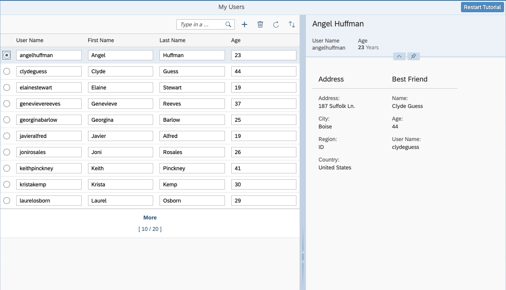

<!-- loioec445816634f45eb88a7e559187dac46 -->

| loio |
| -----|
| ec445816634f45eb88a7e559187dac46 |

<div id="loio">

view on: [demo kit nightly build](https://sdk.openui5.org/nightly/#/topic/ec445816634f45eb88a7e559187dac46) | [demo kit latest release](https://sdk.openui5.org/topic/ec445816634f45eb88a7e559187dac46)</div>

## Step 9: List-Detail Scenario

In this step we add a detail area with additional information.

***

<a name="loioec445816634f45eb88a7e559187dac46__section_bt4_fxc_z1b"/>

### Preview

   
  
**A detail area containing information about the selected user is added**

  

***

<a name="loioec445816634f45eb88a7e559187dac46__section_tsr_gxc_z1b"/>

### Coding

You can view and download all files at [OData V4 - Step 9](https://sdk.openui5.org/entity/sap.ui.core.tutorial.odatav4/sample/sap.ui.core.tutorial.odatav4.09/code).

***

<a name="loioec445816634f45eb88a7e559187dac46__section_pvc_fyc_z1b"/>

### webapp/controller/App.controller.js

```js
...
		onMessageBindingChange : function (oEvent) {
			...
		},

		onSelectionChange : function (oEvent) {
            this._setDetailArea(oEvent.getParameter("listItem").getBindingContext());
        },

...
						        /**
         * Toggles the visibility of the detail area
         *
         * @param {object} [oUserContext] - the current user context
         */
        _setDetailArea : function (oUserContext) {
            var oDetailArea = this.byId("detailArea"),
                oLayout = this.byId("defaultLayout"),
                oSearchField = this.byId("searchField");
 
            oDetailArea.setBindingContext(oUserContext || null);
            // resize view
            oDetailArea.setVisible(!!oUserContext);
            oLayout.setSize(oUserContext ? "60%" : "100%");
            oLayout.setResizable(!!oUserContext);
            oSearchField.setWidth(oUserContext ? "40%" : "20%");
        }
```

The `onSelectionChange` event handler retrieves the context of the selected list item and passes it to a new `_setDetailArea` function. Within `_setDetailArea`, the given context is passed as binding context for the semantic page detail area.

Afterwards the detail area is made visible and is resized.

The application also needs to close the detail area if its binding context is deleted. If the deleted context is restored after a failed DELETE request, or undeleted via `Context#resetChanges`, it could be shown in the detail area again, unless the user had selected another row in the meantime. Hence, we call `_setDetailArea` without a context once the context gets deleted, and with the restored context in the error handler of the `Context#delete` API. In `_setDetailArea` we resize the view based on the given context in an appropriate way.

***

<a name="loioec445816634f45eb88a7e559187dac46__section_pp2_mxc_z1b"/>

### webapp/view/App.view.xml

```xml
<mvc:View
	controllerName="sap.ui.core.tutorial.odatav4.controller.App"
	displayBlock="true"
	xmlns="sap.m"
	xmlns:mvc="sap.ui.core.mvc"
	xmlns:l="sap.ui.layout"
	xmlns:semantic="sap.f.semantic"
	xmlns:f="sap.ui.layout.form"
	xmlns:core="sap.ui.core">
	<Shell>
		<App busy="{appView>/busy}" class="sapUiSizeCompact">
			<pages>
				...
					<content>
						<l:ResponsiveSplitter defaultPane="defaultPane">
							<l:PaneContainer orientation="Horizontal">
								<l:SplitPane id="defaultPane">
									<l:layoutData>
										<l:SplitterLayoutData id="defaultLayout" size="100%" resizable="false"/>
									</l:layoutData>
									<Table
										id="peopleList"
										growing="true"
										growingThreshold="10"
										items="{
											path: '/People',
											parameters: {
												$count: true,
												$$updateGroupId : 'peopleGroup'
											}
										}"
										mode="SingleSelectLeft"
										selectionChange=".onSelectionChange">
										<headerToolbar>
											...
										</headerToolbar>
										...
									</Table>
								</l:SplitPane>
								<l:SplitPane>
									<!--Details-->
									<!--remove busy-->
									<semantic:SemanticPage
										id="detailArea"
										visible="false">
										<semantic:titleHeading>
											<Title
												text="{FirstName} {LastName}"
												level="H2"/>
										</semantic:titleHeading>
										<semantic:headerContent>
												<FlexBox>
													<VBox>
														<ObjectAttribute text="{i18n>userNameLabelText}"/>
														<ObjectAttribute text="{UserName}"/>
													</VBox>
													<VBox class="sapUiMediumMarginBegin">
														<ObjectAttribute text="{i18n>ageLabelText}"/>
														<ObjectNumber number="{Age}" unit="Years"/>
													</VBox>
												</FlexBox>
										</semantic:headerContent>
										<semantic:content>
											<VBox>
												<FlexBox wrap="Wrap">
													<f:Form	editable="false">
														<f:title>
															<core:Title text="{i18n>addressTitleText}" />
														</f:title>
														<f:layout>
															<f:ResponsiveGridLayout
																labelSpanXL="3"
																labelSpanL="3"
																labelSpanM="3"
																labelSpanS="12"
																adjustLabelSpan="false"
																emptySpanXL="4"
																emptySpanL="4"
																emptySpanM="4"
																emptySpanS="0"
																columnsXL="1"
																columnsL="1"
																columnsM="1"
																singleContainerFullSize="false" />
														</f:layout>
														<f:formContainers>
															<f:FormContainer>
																<f:formElements>
																	<f:FormElement label="{i18n>addressLabelText}">
																		<f:fields>
																			<Text text="{HomeAddress/Address}" />
																		</f:fields>
																	</f:FormElement>
																	<f:FormElement label="{i18n>cityLabelText}">
																		<f:fields>
																			<Text text="{HomeAddress/City/Name}" />
																		</f:fields>
																	</f:FormElement>
																	<f:FormElement label="{i18n>regionLabelText}">
																		<f:fields>
																			<Text text="{HomeAddress/City/Region}" />
																		</f:fields>
																	</f:FormElement>
																	<f:FormElement label="{i18n>countryLabelText}">
																		<f:fields>
																			<Text text="{HomeAddress/City/CountryRegion}" />
																		</f:fields>
																	</f:FormElement>
																</f:formElements>
															</f:FormContainer>
														</f:formContainers>
													</f:Form>
													<f:Form	editable="false">
														<f:title>
															<core:Title text="{i18n>bestFriendTitleText}" />
														</f:title>
														<f:layout>
															<f:ResponsiveGridLayout
																labelSpanXL="3"
																labelSpanL="3"
																labelSpanM="3"
																labelSpanS="12"
																adjustLabelSpan="false"
																emptySpanXL="4"
																emptySpanL="4"
																emptySpanM="4"
																emptySpanS="0"
																columnsXL="1"
																columnsL="1"
																columnsM="1"
																singleContainerFullSize="false" />
														</f:layout>
														<f:formContainers>
															<f:FormContainer>
																<f:formElements>
																	<f:FormElement label="{i18n>nameLabelText}">
																		<f:fields>
																			<Text text="{BestFriend/FirstName} {BestFriend/LastName}" />
																		</f:fields>
																	</f:FormElement>
																	<f:FormElement label="{i18n>ageLabelText}">
																		<f:fields>
																			<Text text="{BestFriend/Age}" />
																		</f:fields>
																	</f:FormElement>
																	<f:FormElement label="{i18n>userNameLabelText}">
																		<f:fields>
																			<Text text="{BestFriend/UserName}" />
																		</f:fields>
																	</f:FormElement>
																</f:formElements>
															</f:FormContainer>
														</f:formContainers>
													</f:Form>
												</FlexBox>
											</VBox>
										</semantic:content>
									</semantic:SemanticPage>
								</l:SplitPane>
							</l:PaneContainer>
						</l:ResponsiveSplitter>
					</content>
					...
</mvc:View>
```

Several new namespaces are added to the `appView`. After the `<content>` and before the `<Table>` tag the first part of the `SplitPane` is added.

We add a detail area after the user table. In the `appView` we add a splitter layout around the existing table. The first `SplitPane` contains the table with all users, and the second one contains the new detail area. It consists of two forms, one for the address information, and the other one for the best friend of the currently selected user. We also add the `onSelectionChange` event handler to the user table.

It is important that all bindings we introduced in the detail area are relative \(property\) bindings, so that we can reuse data of the list. This allows our application to share data like the user name or the age between the user selected in the table and the detail area. This helps to avoid redundant requests and to keep the data between the two areas in sync. Editing a property in the user table will thus automatically be reflected in the detail area as well.

One of the most vital parts of the data reuse functionality is the usage of the `autoExpandSelect` binding parameter. It permits us to put a tailored `$select` clause in the `GET` request, so that only missing properties are requested for display in the detail area.

***

<a name="loioec445816634f45eb88a7e559187dac46__section_kl4_d1x_4cb"/>

### webapp/i18n/i18n.properties

```ini
...
# Detail Area
#XTIT: Title for Address
addressTitleText=Address
 
#XFLD: Label for Address
addressLabelText=Address
 
#XFLD: Label for City
cityLabelText=City
 
#XFLD: Label for Region
regionLabelText=Region
 
#XFLD: Label for Country
countryLabelText=Country
 
#XTIT: Title for Best Friend
bestFriendTitleText=Best Friend
 
#XFLD: Label for Best Friend Name
nameLabelText=Name

```

We add the missing texts to the properties file.

**Parent topic:** [OData V4](OData_V4_bcdbde6.md "In this tutorial, we explore how features of OData V4 can be used in OpenUI5. We write a small app that consumes data from an OData V4 service to understand how to access, modify, aggregate, and filter data in an OData V4 model.")

**Next:** [Step 8: OData Operations](Step_8_OData_Operations_a3e7cb6.md "Our OData service provides one OData operation: the ResetDataSource action. In this step, we add a button that resets all data changes we made during the tutorial to their original state using this action.")

**Previous:** [Step 10: Enable Data Reuse](Step_10_Enable_Data_Reuse_e687dbd.md "In this step we avoid unnecessary back-end requests by preventing the destruction of data shown in the detail area when sorting or filtering the list.")

**Related Information**  


[Data Reuse](Data_Reuse_648e360.md "The OData V4 model keeps data with respect to bindings, which allows different views on the same data, but also means that data is not automatically shared between bindings. There are mechanisms for sharing data to avoid redundant requests and to keep the same data in different controls in sync.")

