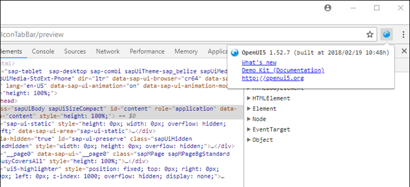
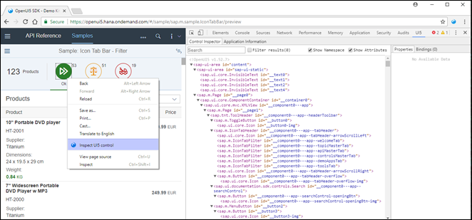
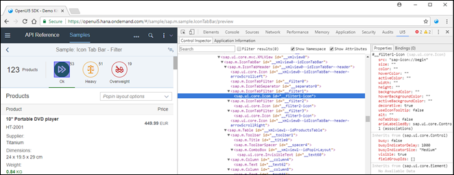
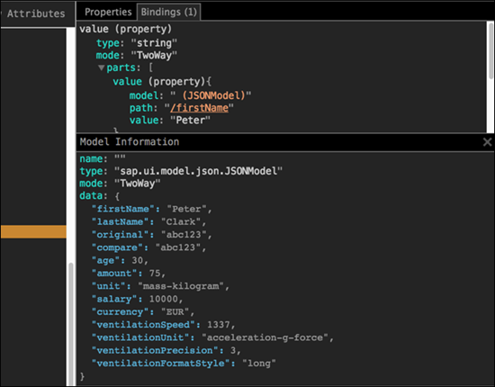

<!-- loiob24e72443eb34d0fb7bf6940f2d697eb -->

| loio |
| -----|
| b24e72443eb34d0fb7bf6940f2d697eb |

view on: [demo kit nightly build](https://sdk.openui5.org/nightly/#/topic/b24e72443eb34d0fb7bf6940f2d697eb) | [demo kit latest release](https://sdk.openui5.org/topic/b24e72443eb34d0fb7bf6940f2d697eb)

## UI5 Inspector

The UI5 Inspector is an open source Chrome DevTools extension that helps app developers to inspect, analyze, and support OpenUI5-based apps. It is supported for apps based on OpenUI5 version 1.28 and higher.

Check out the UI5 Inspector video on YouTube for a quick overview of the most common use cases.

Key features:

-   Inspect OpenUI5 controls and review their properties, bindings, and data model

-   Modify control properties on the fly and see how this affects rendering and behavior

-   Find relevant framework information for your OpenUI5 app

***

### How to get it?

You can download the UI5 Inspector as a standard extension from the Chrome Web Store at [https://chrome.google.com/webstore/detail/ui5-inspector/bebecogbafbighhaildooiibipcnbngo?hl=en](https://chrome.google.com/webstore/detail/ui5-inspector/bebecogbafbighhaildooiibipcnbngo?hl=en).

***

### Features

Once installed, the UI5 Inspector is available in Chrome DevTools \(by choosing [F12\]\). It becomes active when an OpenUI5 app is loaded.

**Browser Action**

Clicking the browser action icon in the address bar provides you with:

-   Information on the used OpenUI5 version

-   Links to the *What's New in OpenUI5* section and the OpenUI5 documentation

-   Link to the OpenUI5 website

> ### Note:  
> Your version of OpenUI5 may be older than the latest and the features described in the documentation may not be available for you.

  

**Control Inspector**

This tab shows the structure and nesting of the OpenUI5 controls. You can search and filter for specific controls. You have the options to show/hide the control's namespace and attributes in the tree.

Hovering over a specific branch of the tree highlights the corresponding control in the app.

Additionally, you can right click on any OpenUI5 control from the app and select *Inspect UI5 control*. This automatically selects the control in the tree and you can review its properties directly.

  

  

**Properties**

In this tab, you can see the properties that have been set for the selected control. Additionally, the inherited properties are also listed.

You can change the values of the properties. The changes will be validated against the framework and rendered on the fly.

> ### Note:  
> Errors from incorrectly set values are displayed in the Chrome browser's console.

**Bindings**

In this tab, you can see the bindings for a specific control. The number of bindings is displayed in parentheses in the tab title. Selecting the tab gives you more information about individual models, paths and values. The model property holds a link to the corresponding binding file. Clicking on the link opens the *Model Information* section with details about all values.

> ### Tip:  
> UI5 Inspector supports a dark theme in case you are using the Google Developer Tools in dark mode.

**Application Information**

In this tab, you can see overall information for your app – for example, the exact OpenUI5 version you are running, the version of your browser, and the app URL. The information on the loaded libraries and modules is collapsed by default.

