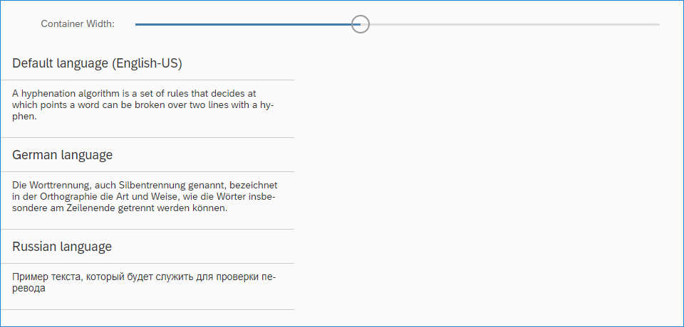
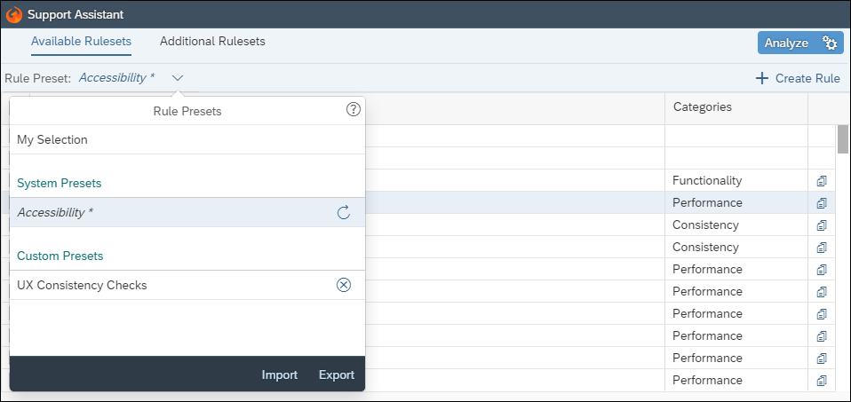
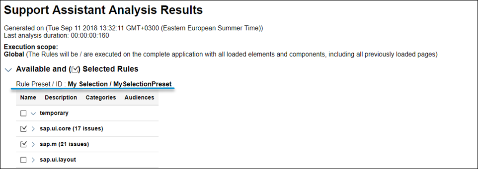
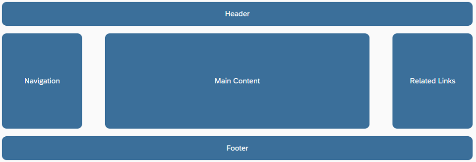
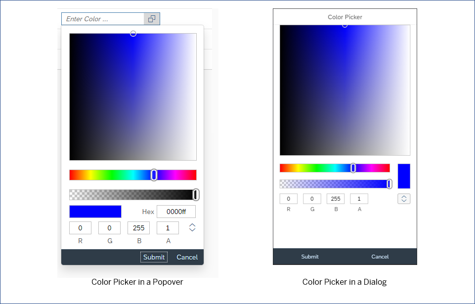

<!-- loio5a0e1f79c4cf4772a177310e7a9c7ba0 -->

| loio |
| -----|
| 5a0e1f79c4cf4772a177310e7a9c7ba0 |

<div id="loio">

view on: [demo kit nightly build](https://sdk.openui5.org/nightly/#/topic/5a0e1f79c4cf4772a177310e7a9c7ba0) | [demo kit latest release](https://sdk.openui5.org/topic/5a0e1f79c4cf4772a177310e7a9c7ba0)</div>

## What's New in OpenUI5 1.60

With this release OpenUI5 is upgraded from version 1.58 to 1.60.

** **


<table>
<tr>
<th valign="top">

Version


</th>
<th valign="top">

Type


</th>
<th valign="top">

Category


</th>
<th valign="top">

Title


</th>
<th valign="top">

Description


</th>
<th valign="top">

Action


</th>
<th valign="top">

Available as of


</th>
</tr>
<tr>
<td valign="top">

 1.60 


</td>
<td valign="top">

 New 


</td>
<td valign="top">

 Feature 


</td>
<td valign="top">

 **Hyphenation for Text Controls** 


</td>
<td valign="top">

**Hyphenation for Text Controls**

OpenUI5 now allows you to hyphenate words in multiline texts when controls are in wrapping mode. You can enable hyphenation through the `wrappingType` property for the `sap.m.Text`, `sap.m.Title`, and `sap.m.Label` text controls, or you can use the API of the The hyphenation feature uses third-party and browser-native tools. We are not responsible for any inconsistencies or incorrect grammar. Also, the variety of supported languages is outside the scope of our control and may be subject to future changes.`sap.ui.core.hyphenation.Hyphenation` class directly.



> ### Caution:  

For more information, see [Hyphenation for Text Controls](Hyphenation_for_Text_Controls_6322164.md), the [Sample](https://sdk.openui5.org/sample/sap.ui.core.sample.HyphenationAPI/preview), and the *API Reference* for [`sap.m.Text`](https://sdk.openui5.org/api/sap.m.Text), [`sap.m.Title`](https://sdk.openui5.org/api/sap.m.Title), [`sap.m.Label`](https://sdk.openui5.org/api/sap.m.Label), and [`sap.ui.core.hyphenation.Hyphenation`](https://sdk.openui5.org/api/sap.ui.core.hyphenation.Hyphenation)..

<sub>New•Feature•Info Only•1.60</sub>


</td>
<td valign="top">

Info Only


</td>
<td valign="top">

2018-11-15


</td>
</tr>
<tr>
<td valign="top">

 1.60 


</td>
<td valign="top">

 New 


</td>
<td valign="top">

 Feature 


</td>
<td valign="top">

 **Support Assistant** 


</td>
<td valign="top">

**Support Assistant**

**System Presets**

In addition to the custom rule presets that users can create, we've introduced system-defined presets. They constitute a selection of rules related within the context of a certain scenario, functional area, or other aspects of the application UI that can be checked using support rules. System presets are part of the Support Assistant code and appear by default for all users. They cannot be deleted but can be modified and exported as regular presets.

The first system preset we've introduced is for accessibility-related rules.



For more information, see [Rules Management](Rules_Management_3fc864a.md).

**Rule Presets in the Analysis Report**

The Analysis Report now includes information about the rule preset used during the analysis. This information is also available in the downloadable HTML report and in all JSON formats that the API supports, through `jQuery.sap.support.getAnalysisHistory()` and `jQuery.sap.support.getFormattedAnalysisHistory()`.

We have also improved the design of the report itself.



For more information, see [Analysis Report](Analysis_Report_29bcdec.md).

**Support Assistant API**

The `jQuery.sap.support.analyze` method of the Support Assistant API can now accept a rule preset and use it to run an analysis as an alternative to manually listed rule selection. For more information, see [Support Assistant API](Support_Assistant_API_a34eb58.md).

<sub>New•Feature•Info Only•1.60</sub>


</td>
<td valign="top">

 Info Only 


</td>
<td valign="top">

2018-11-15


</td>
</tr>
<tr>
<td valign="top">

 1.60 


</td>
<td valign="top">

 New 


</td>
<td valign="top">

 Feature 


</td>
<td valign="top">

 **UI5 Evolution** 


</td>
<td valign="top">

**UI5 Evolution**

UI5 evolutionThe hyphenation feature uses third-party and browser-native represents fundamental improvements that have been introduced into the framework in an ongoing effort to advance OpenUI5, so that it allows applications to run faster and code to become more modular. By embracing web standards and emerging technologies, OpenUI5 continues to be a future-proof, enterprise-proven solution. These innovations are provided in a largely compatible way, encouraging developers to actively support and leverage the new capabilities.

**Modular Core**

Existing modules in the modulare core have been reworked to follow the AMD-like \(asynchronous module definition\) syntax of OpenUI5, which ensures that modules and their dependencies can be loaded and evaluated asynchronously. The Asynchronous Module Definition \(AMD\) specifies a mechanism for defining modules so that the module and its dependencies can be loaded asynchronously. It allows you to avoid accessing modules via global variables and enforces a strict dependency declaration. The documentation has been enhanced accordingly and also made more prominent.For more information, see [Modules and Dependencies](Modules_and_Dependencies_91f23a7.md).

The core part of the framework has improved its modular structure by leveraging OpenUI5's AMD-like features such as [sap.ui.define](https://sdk.openui5.org/api/sap.ui/methods/sap.ui.define) and [sap.ui.require](https://sdk.openui5.org/api/sap.ui/methods/sap.ui.require). Already starting with 1.58, the former `jQuery.sap` modules were replaced by new, more granular modules. The new modules are separated either into a regular browser-dependent "UI" layer or into a "base" layer that is independent from the browser-native API and the DOM.For more information, see [Adapting to the Modularization of the Core](Adapting_to_the_Modularization_of_the_Core_b8fdf0c.md).

Several mechanisms have been introduced to allow existing applications to continue to run without changes. Nevertheless, all OpenUI5 projects should start to migrate their code and leverage the new core modules to get rid of the deprecated modules and benefit from current or upcoming improvements, especially towards the AMD-like syntax of OpenUI5.

A comprehensive overview shows how you can replace legacy `jQuery.sap` modules and `jQuery` extensions with new modules or native browser APIs. For more information, see [Legacy jQuery.sap Replacement](Legacy_jQuery_sap_Replacement_a075ed8.md). The Support Assistant also comes with new rules to help identify legacy code, and best practices for module definition and asynchronous loading are also provided.For more information, see [Best Practices for Loading Modules](Best_Practices_for_Loading_Modules_00737d6.md).

**Asynchronous API**

In order to benefit from asynchronous behavior and to avoid synchronous requests \(as browsers start to deprecate sync XHR\), future-proof OpenUI5 code should use asynchronous APIs. One important step to get there with your existing code is to replace synchronous factory functions, such as global functions in the `sap.ui` namespace, with asynchronous alternatives. Many asynchronous factories are now available via a consistent and elegant API. The documentation provides examples of former sync factories and their preferred async alternatives.For more information, see [Legacy Factories Replacement](Legacy_Factories_Replacement_491bd9c.md).

<sub>New•Feature•Info Only•1.60</sub>


</td>
<td valign="top">

 Info Only 


</td>
<td valign="top">

2018-11-15


</td>
</tr>
<tr>
<td valign="top">

 1.60 


</td>
<td valign="top">

 New 


</td>
<td valign="top">

 Control 


</td>
<td valign="top">

 **`sap.f.GridList`** 


</td>
<td valign="top">

**`sap.f.GridList`**

A list-based control with grid layout capabilities. It is based on the `sap.m.ListBase` control, and it adds flexibility to configure different grid layouts. The layout used is based on the CSS display grid, and the control has a default configuration.


For more information, see [Grid Controls](Grid_Controls_32d4b9c.md), the [API Reference](https://sdk.openui5.org/api/sap.f.GridList), and the [Samples](https://sdk.openui5.org/entity/sap.f.GridList)..

<sub>New•Control•Info Only•1.60</sub>


</td>
<td valign="top">

 Info Only 


</td>
<td valign="top">

2018-11-15


</td>
</tr>
<tr>
<td valign="top">

 1.60 


</td>
<td valign="top">

 New 


</td>
<td valign="top">

 Control 


</td>
<td valign="top">

 **`sap.ui.layout.cssgrid.CSSGrid`** 


</td>
<td valign="top">

**`sap.ui.layout.cssgrid.CSSGrid`**

`sap.m.FlexBox` which is the one-dimensional alternative for layouting.A layout control, used to create full-page layouts or user interface elements. It is a two-dimensional layout based on the browser-native CSS display grid that handles both columns and rows. The control can be used together with



For more information, see [Grid Controls](Grid_Controls_32d4b9c.md), the [API Reference](https://sdk.openui5.org/api/sap.ui.layout.cssgrid.CSSGrid), and the [Samples](https://sdk.openui5.org/entity/sap.ui.layout.cssgrid.CSSGrid)..

<sub>New•Control•Info Only•1.60</sub>


</td>
<td valign="top">

 Info Only 


</td>
<td valign="top">

2018-11-15


</td>
</tr>
<tr>
<td valign="top">

 1.60 


</td>
<td valign="top">

 New 


</td>
<td valign="top">

 Control 


</td>
<td valign="top">

 **`sap.ui.unified.ColorPickerPopover`** 


</td>
<td valign="top">

**`sap.ui.unified.ColorPickerPopover`**

A wrapper around the `sap.ui.unified.ColorPicker`A control that allows it to be displayed as a popover or a dialog depending on the device. The `ColorPickerPopover` has the same properties as the `ColorPicker` control but it has two additional methods - `openBy` and `close` to control the popover. Another difference between the new control and the `ColorPicker` control is that there is no `liveChange` event, and the `change` event is fired only when the *Submit* button is pressed. For more information, see the [API Reference](https://sdk.openui5.org/api/sap.ui.unified.ColorPickerPopover) and the [Sample](https://sdk.openui5.org/sample/sap.ui.unified.sample.ColorPickerPopover/preview).

  

<sub>New•Control•Info Only•1.60</sub>


</td>
<td valign="top">

 Info Only 


</td>
<td valign="top">

2018-11-15


</td>
</tr>
<tr>
<td valign="top">

 1.60 


</td>
<td valign="top">

 Changed 


</td>
<td valign="top">

 Feature 


</td>
<td valign="top">

 **OpenUI5 OData V4 Model** 


</td>
<td valign="top">

**OpenUI5 OData V4 Model**

The new version of the OpenUI5 OData V4 model introduces the following features:

-   Batch requests with `create`, `update`, and `delete` change operations for the same group ID are no longer sent in parallel. The next batch request waits for the previous request to return.

-   The path of a transient context changes to the key predicate path when the new entity is successfully submitted. The key predicate path can be used for binding the entity elsewhere.

-   If the same entity is returned by the operation, the binding parameter of a bound operation is automatically updated.

-   V4 Analytics: We now support grand total calculation without visual grouping.

-   We now support the `ValueList` annotation in addition to the `ValueListMapping` annotation.

-   `sap.ui.model.odata.v4.ODataListBinding#create`:

    -   When calling `sap.ui.model.odata.v4.ODataListBinding#create`, you no longer have to specify all properties that are used in the binding. If available, the binding provides the default values. If no default values are available, the binding provides null.

    -   The new parameter `bSkipRefresh` suppresses the refresh after the POST request.


-   We have introduced the new binding parameter `$$patchWithoutSideEffects` for context bindings, to avoid updating the UI with the data response of a PATCH request.


> ### Restriction:  
> Due to the limited feature scope of this version of the OpenUI5 OData V4 model, check that all required features are in place before developing applications. Check the detailed documentation of the features, as certain parts of a feature may be missing. While we aim to be compatible with existing controls, some controls might not work due to small incompatibilities compared to `sap.ui.model.odata.(v2.)ODataModel`, or due to missing features in the model \(such as tree binding\). This also applies to controls such as `TreeTable` and `AnalyticalTable`, which are not supported together with the OpenUI5 OData V4 model. The interface for applications has been changed for easier and more efficient use of the model. For a summary of these changes, see [Changes Compared to OData V2 Model](Changes_Compared_to_OData_V2_Model_abd4d7c.md).

For more information, see [OData V4 Model](OData_V4_Model_5de13cf.md), the [API Reference](https://sdk.openui5.org/api/sap.ui.model.odata.v4), and the [Samples](https://sdk.openui5.org/entity/sap.ui.model.odata.v4.ODataModel).

<sub>Changed•Feature•Info Only•1.60</sub>


</td>
<td valign="top">

 Info Only 


</td>
<td valign="top">

2018-11-15


</td>
</tr>
<tr>
<td valign="top">

 1.60 


</td>
<td valign="top">

 Changed 


</td>
<td valign="top">

 Feature 


</td>
<td valign="top">

 **Aggregation Forwarding for Composite Controls** 


</td>
<td valign="top">

**Aggregation Forwarding for Composite Controls**

Aggregation forwarding for composite controls now offers the following options:

-   Child controls in a public, forwarded aggregation are now automatically cloned by the framework together with the composite control.

-   You can now define forwarding from a single \(to-1\) to a multiple aggregation \(to-n\).

-   A control that has been forwarded will always have the same models as the ones available at the original location **before** the forwarding.

    For example, a model that a composite control developer sets on an inner control is not propagated to the child controls of this inner control if they have been moved there by aggregation forwarding. Instead, the models available at the original location of these child controls will be propagated to them.


For more information, see [Aggregation Forwarding](Aggregation_Forwarding_64a5e17.md).

<sub>Changed•Feature•Info Only•1.60</sub>


</td>
<td valign="top">

 Info Only 


</td>
<td valign="top">

2018-11-15


</td>
</tr>
<tr>
<td valign="top">

 1.60 


</td>
<td valign="top">

 Changed 


</td>
<td valign="top">

 Feature 


</td>
<td valign="top">

 **Drag and Drop** 


</td>
<td valign="top">

Feature

Drag and drop is no longer experimental with this version.

> ### Note:  
> If you want to use drag and drop for a control, the control must allow drag and drop \(per definition in the metadata\), and you have to make the required settings in the relevant aggregation.

For more information, see [Drag and Drop](Drag_and_Drop_3ddb6cd.md), the [API Reference: `dragDropConfig` aggregation](https://sdk.openui5.org/api/sap.ui.core.Element/aggregations), and the [API Reference: `sap.m.ListBase`](https://sdk.openui5.org/api/sap.m.ListBase) \(control that allows drag and drop\)..

<sub>Changed•Feature•Info Only•1.60</sub>


</td>
<td valign="top">

 Info Only 


</td>
<td valign="top">

2018-11-15


</td>
</tr>
<tr>
<td valign="top">

 1.60 


</td>
<td valign="top">

 Changed 


</td>
<td valign="top">

 Control 


</td>
<td valign="top">

 **`sap.f.FlexibleColumnLayout`** 


</td>
<td valign="top">

**`sap.f.FlexibleColumnLayout`**

A new sample now shows the control as an app with routing that displays different pages in the initial column. The first page is only displayed in `OneColumn` layout type. For more information, see the [Sample](https://sdk.openui5.org/sample/sap.f.sample.FlexibleColumnLayoutWithFullscreenPage/preview).

<sub>Changed•Control•Info Only•1.60</sub>


</td>
<td valign="top">

 Info Only 


</td>
<td valign="top">

2018-11-15


</td>
</tr>
<tr>
<td valign="top">

 1.60 


</td>
<td valign="top">

 Changed 


</td>
<td valign="top">

 Control 


</td>
<td valign="top">

 `sap.m.Image` 


</td>
<td valign="top">

`sap.m.Image`

To optimize app performance, we changed the default value of the `densityAware` property to `false`. App developers should enable this property only if the app provides the corresponding image versions for high-density devices.For more information, see the [API Reference](https://sdk.openui5.org/api/sap.m.Image/controlProperties).

<sub>Changed•Control•Info Only•1.60</sub>


</td>
<td valign="top">

 Info Only 


</td>
<td valign="top">

2018-11-15


</td>
</tr>
<tr>
<td valign="top">

 1.60 


</td>
<td valign="top">

 Changed 


</td>
<td valign="top">

 Control 


</td>
<td valign="top">

 **`sap.m.MessageView`/`sap.m.MessagePopover`** 


</td>
<td valign="top">

**`sap.m.MessageView`/`sap.m.MessagePopover`**

A keyboard accelerator for the  [Alt\] + [Enter\]  event has been added. Now, when the focus is on *item* with the `activeTitle` property set to `true`, and when the  [Alt\] + [Enter\]  is triggered, the `activeTitlePress` callback is fired. Screen reader support was also improved. Information that the defined keyboard accelerators can be used for easier navigation has been provided to its users.

<sub>Changed•Control•Info Only•1.60</sub>


</td>
<td valign="top">

 Info Only 


</td>
<td valign="top">

2018-11-15


</td>
</tr>
<tr>
<td valign="top">

 1.60 


</td>
<td valign="top">

 Changed 


</td>
<td valign="top">

 Control 


</td>
<td valign="top">

 **`sap.m.MultiComboBox`** 


</td>
<td valign="top">

**`sap.m.MultiComboBox`**

-   We have implemented a dropdown list with a two-column layout. You can now use the `MultiComboBox` with a two-column layout to display additional information for your options. To enable this feature, you need to set the `showSecondaryValues` property to `true`. This feature was initially available only for the `ComboBox` and has now been enabled for the `MultiComboBox` as well. This property indicates whether the text values of the `additionalText` property of a `sap.ui.core.ListItem` are shown.For more information, see the [Sample](https://sdk.openui5.org/sample/sap.m.sample.MultiComboBoxTwoColumnsLayout/preview).

-   We have introduced grouping in the suggestion list of `sap.m.MultiComboBox`. This feature allows you to easily group items by common characteristics and to display a header describing the characteristics for each group. If data binding is used, grouping is defined on the `Sorter` in data binding. Alternatively, a group header could be added programmatically, as an instance of `sap.ui.core.SeparatorItem` with `key` and/or `text` properties, by adding it to the `items` aggregation of the `sap.m.MultiComboBox` control.For more information, see the [Sample](https://sdk.openui5.org/sample/sap.m.sample.MultiComboBoxGrouping/preview).


<sub>Changed•Control•Info Only•1.60</sub>


</td>
<td valign="top">

 Info Only 


</td>
<td valign="top">

2018-11-15


</td>
</tr>
<tr>
<td valign="top">

 1.60 


</td>
<td valign="top">

 Changed 


</td>
<td valign="top">

 Control 


</td>
<td valign="top">

 **`sap.m.Page`** 


</td>
<td valign="top">

**`sap.m.Page`**

We have made `sap.m.Page` a droppable area.

<sub>Changed•Control•Info Only•1.60</sub>


</td>
<td valign="top">

 Info Only 


</td>
<td valign="top">

2018-11-15


</td>
</tr>
<tr>
<td valign="top">

 1.60 


</td>
<td valign="top">

 Changed 


</td>
<td valign="top">

 Control 


</td>
<td valign="top">

 **`sap.m.PlanningCalendar`** 


</td>
<td valign="top">

**`sap.m.PlanningCalendar`**

The `stickyHeader` property is no longer experimental.For more information, see the [API Reference](https://sdk.openui5.org/api/sap.m.PlanningCalendar).

<sub>Changed•Control•Info Only•1.60</sub>


</td>
<td valign="top">

 Info Only 


</td>
<td valign="top">

2018-11-15


</td>
</tr>
<tr>
<td valign="top">

 1.60 


</td>
<td valign="top">

 Changed 


</td>
<td valign="top">

 Control 


</td>
<td valign="top">

 **`sap.m.SearchField`** 


</td>
<td valign="top">

**`sap.m.SearchField`**

The live search function of the control was originally designed to trigger a backend call after each keystroke to retrieve partially-matching suggestions. Now, we have introduced a default delay of 400 ms before sending the searched data to the backend, to ensure better performance and optimal user experience. For more information, see the [Sample](https://sdk.openui5.org/sample/sap.m.sample.SearchFieldSuggestions/preview).

<sub>Changed•Control•Info Only•1.60</sub>


</td>
<td valign="top">

 Info Only 


</td>
<td valign="top">

2018-11-15


</td>
</tr>
<tr>
<td valign="top">

 1.60 


</td>
<td valign="top">

 Changed 


</td>
<td valign="top">

 Control 


</td>
<td valign="top">

 **`sap.m.table`** 


</td>
<td valign="top">

**`sap.m.table`**

-   The `contextualWidth` property is now available in the responsive table which allows you to control the popin behavior based on the size of a container rather than a whole page. For more information, see the [API Reference](https://sdk.openui5.org/api/sap.m.Table/controlProperties) for the `contextualWidth` property and the [`ContextualWidthDynamic` Sample](https://sdk.openui5.org/sample/sap.m.sample.TableContextualWidthDynamic/preview) as well as the [`ContextualWidthStatic` Sample](https://sdk.openui5.org/sample/sap.m.sample.TableContextualWidthStatic/preview).

-   The `paste` event has been added to the responsive table. For more information, see the [API Reference](https://sdk.openui5.org/api/sap.m.Table/events/paste) and the [Sample](https://sdk.openui5.org/sample/sap.m.sample.TableEditable/preview).

<sub>Changed•Control•Info Only•1.60</sub>


</td>
<td valign="top">

 Info Only 


</td>
<td valign="top">

2018-11-15


</td>
</tr>
<tr>
<td valign="top">

 1.60 


</td>
<td valign="top">

 Changed 


</td>
<td valign="top">

 Control 


</td>
<td valign="top">

 **`sap.m.UploadCollection`** 


</td>
<td valign="top">

**`sap.m.UploadCollection`**

The control's functionality has been unified, so the behavior is now more consistent, regardless of whether the `instantUpload` mode is enabled. With the new `beforeUploadTermination` event, you can adjust the control’s behavior when the file upload is terminated by the user before completion. If the default upload behavior is not applicable to your app, you can now also implement custom upload logic using the `CollectionUploader` class.For more information, see the [API Reference](https://sdk.openui5.org/api/sap.m.UploadCollection).

<sub>Changed•Control•Info Only•1.60</sub>


</td>
<td valign="top">

 Info Only 


</td>
<td valign="top">

2018-11-15


</td>
</tr>
<tr>
<td valign="top">

 1.60 


</td>
<td valign="top">

 Changed 


</td>
<td valign="top">

 Control 


</td>
<td valign="top">

 **`sap.m.ViewSettingsDialog`** 


</td>
<td valign="top">

**`sap.m.ViewSettingsDialog`**

Several visual improvements were implemented - the *OK* button is now displayed as emphasized and there is a better visual separation of the items displayed in the *Sort By*, *Filter By* and *Group By* tabs.For more information, see the [Sample](https://sdk.openui5.org/sample/sap.m.sample.ViewSettingsDialog/preview).

<sub>Changed•Control•Info Only•1.60</sub>


</td>
<td valign="top">

 Info Only 


</td>
<td valign="top">

2018-11-15


</td>
</tr>
<tr>
<td valign="top">

 1.60 


</td>
<td valign="top">

 Changed 


</td>
<td valign="top">

 Control 


</td>
<td valign="top">

 **`sap.ui.core.AccessibleLandmarkRole`** 


</td>
<td valign="top">

**`sap.ui.core.AccessibleLandmarkRole`**

We have extended the `AccessibleLandmarkRole` enumeration with the roles Form and ContentInfo. These accessible landmarks could be applied to the container elements of `sap.m.Page`. For more information, see the [API Reference](https://sdk.openui5.org/api/sap.ui.core.AccessibleLandmarkRole).

<sub>Changed•Control•Info Only•1.60</sub>


</td>
<td valign="top">

 Info Only 


</td>
<td valign="top">

2018-11-15


</td>
</tr>
<tr>
<td valign="top">

 1.60 


</td>
<td valign="top">

 Changed 


</td>
<td valign="top">

 Control 


</td>
<td valign="top">

 **`sap.ui.core.ValueState`** 


</td>
<td valign="top">

**`sap.ui.core.ValueState`**

We have introduced `sap.ui.core.ValueState.Information` as a new semantic color value to the `ValueState` enumeration. For more information, see the [API Reference](https://sdk.openui5.org/api/sap.ui.core.ValueState) and the [Sample](https://sdk.openui5.org/sample/sap.m.sample.InputValueState/preview).

<sub>Changed•Control•Info Only•1.60</sub>


</td>
<td valign="top">

 Info Only 


</td>
<td valign="top">

2018-11-15


</td>
</tr>
<tr>
<td valign="top">

 1.60 


</td>
<td valign="top">

 Changed 


</td>
<td valign="top">

 Control 


</td>
<td valign="top">

 **`sap.ui.table`** 


</td>
<td valign="top">

**`sap.ui.table`**

The `paste` event has been added to the grid table. For more information, see the [API Reference](https://sdk.openui5.org/api/sap.ui.table.Table/events/paste) and the [Sample](https://sdk.openui5.org/sample/sap.ui.table.sample.Basic/preview).

<sub>Changed•Control•Info Only•1.60</sub>


</td>
<td valign="top">

 Info Only 


</td>
<td valign="top">

2018-11-15


</td>
</tr>
<tr>
<td valign="top">

 1.60 


</td>
<td valign="top">

 Changed 


</td>
<td valign="top">

 Control 


</td>
<td valign="top">

 **`sap.ui.unified.Calendar`** 


</td>
<td valign="top">

**`sap.ui.unified.Calendar`**

-   **Week selection**: Users can now select/deselect all the days in a given week at once by choosing the week number or by pressing  [SHIFT\] + [SPACE\]  on any day of the week.

-   **Range selection**: We introduced two more shortcuts -  [SHIFT\] + [ENTER\]  and  [SHIFT\] + [Left Mouse Button\] . Both of them select/deselect all days between the two selected dates.


For more information, see the [Sample](https://sdk.openui5.org/sample/sap.ui.unified.sample.CalendarMultipleDaySelection/preview).

<sub>Changed•Control•Info Only•1.60</sub>


</td>
<td valign="top">

 Info Only 


</td>
<td valign="top">

2018-11-15


</td>
</tr>
<tr>
<td valign="top">

 1.60 


</td>
<td valign="top">

 Changed 


</td>
<td valign="top">

 Control 


</td>
<td valign="top">

 **`sap.uxap.ObjectPageLayout`** 


</td>
<td valign="top">

**`sap.uxap.ObjectPageLayout`**

With the new `sapUxAPObjectPageSubSectionAlignContent` CSS class, you can now vertically align the content of the header with the content of the subsection. When using `sap.ui.layout.form.Form`, `sap.m.Panel`, `sap.m.Table`, and `sap.m.List` in the subsection content area of the `ObjectPageLayout`, if the content is not already aligned, you need to adjust the left text offset to achieve the vertical alignment. To do this, apply the `sapUxAPObjectPageSubSectionAlignContent` CSS class to them and set their `width` property to `auto` \(if not set by default\).

```xml
<Panel class="sapUxAPObjectPageSubSectionAlignContent" width="auto"></Panel>
```

For more information, see the [API Reference](https://sdk.openui5.org/api/sap.uxap.ObjectPageSubSection/aggregations) and the [Sample](https://sdk.openui5.org/sample/sap.uxap.sample.ObjectPageLazyLoadingWithoutBlocks/preview).

<sub>Changed•Control•Info Only•1.60</sub>


</td>
<td valign="top">

 Info Only 


</td>
<td valign="top">

2018-11-15


</td>
</tr>
<tr>
<td valign="top">

 1.60 


</td>
<td valign="top">

 Changed 


</td>
<td valign="top">

 User Documentation 


</td>
<td valign="top">

 **Accessibility Improvements in Demo Apps and in the Walkthrough Tutorial** 


</td>
<td valign="top">

**Accessibility Improvements in Demo Apps and in the Walkthrough Tutorial**

We have improved the accessibility of our demo apps. In addition, we have updated our *Walkthrough* tutorial and added a new step. Developers can improve the accessibility of their Walkthrough app by adding ARIA elements \(landmarks\). For more information, see [Step 37: Accessibility](Step_37_Accessibility_ff7cab1.md).

<sub>Changed•User Documentation•Info Only•1.60</sub>


</td>
<td valign="top">

 Info Only 


</td>
<td valign="top">

2018-11-15


</td>
</tr>
</table>

**Parent topic:** [Previous Versions](Previous_Versions_6660a59.md "")

**Related Information**  


[What's New in OpenUI5 1.110](What_s_New_in_OpenUI5_1_110_71a855c.md "With this release OpenUI5 is upgraded from version 1.109 to 1.110.")

[What's New in OpenUI5 1.109](What_s_New_in_OpenUI5_1_109_3264bd2.md "With this release OpenUI5 is upgraded from version 1.108 to 1.109.")

[What's New in OpenUI5 1.108](What_s_New_in_OpenUI5_1_108_66e33f0.md "With this release OpenUI5 is upgraded from version 1.107 to 1.108.")

[What's New in OpenUI5 1.107](What_s_New_in_OpenUI5_1_107_d4ff916.md "With this release OpenUI5 is upgraded from version 1.106 to 1.107.")

[What's New in OpenUI5 1.106](What_s_New_in_OpenUI5_1_106_5b497b0.md "With this release OpenUI5 is upgraded from version 1.105 to 1.106.")

[What's New in OpenUI5 1.105](What_s_New_in_OpenUI5_1_105_4d6c00e.md "With this release OpenUI5 is upgraded from version 1.104 to 1.105.")

[What's New in OpenUI5 1.104](What_s_New_in_OpenUI5_1_104_69e567c.md "With this release OpenUI5 is upgraded from version 1.103 to 1.104.")

[What's New in OpenUI5 1.103](What_s_New_in_OpenUI5_1_103_0e98c76.md "With this release OpenUI5 is upgraded from version 1.102 to 1.103.")

[What's New in OpenUI5 1.102](What_s_New_in_OpenUI5_1_102_f038c99.md "With this release OpenUI5 is upgraded from version 1.101 to 1.102.")

[What's New in OpenUI5 1.101](What_s_New_in_OpenUI5_1_101_7733b00.md "With this release OpenUI5 is upgraded from version 1.100 to 1.101.")

[What's New in OpenUI5 1.100](What_s_New_in_OpenUI5_1_100_27dec1d.md "With this release OpenUI5 is upgraded from version 1.99 to 1.100.")

[What's New in OpenUI5 1.99](What_s_New_in_OpenUI5_1_99_4f35848.md "With this release OpenUI5 is upgraded from version 1.98 to 1.99.")

[What's New in OpenUI5 1.98](What_s_New_in_OpenUI5_1_98_d9f16f2.md "With this release OpenUI5 is upgraded from version 1.97 to 1.98.")

[What's New in OpenUI5 1.97](What_s_New_in_OpenUI5_1_97_fa0e282.md "With this release OpenUI5 is upgraded from version 1.96 to 1.97.")

[What's New in OpenUI5 1.96](What_s_New_in_OpenUI5_1_96_7a9269f.md "With this release OpenUI5 is upgraded from version 1.95 to 1.96.")

[What's New in OpenUI5 1.95](What_s_New_in_OpenUI5_1_95_a1aea67.md "With this release OpenUI5 is upgraded from version 1.94 to 1.95.")

[What's New in OpenUI5 1.94](What_s_New_in_OpenUI5_1_94_c40f1e6.md "With this release OpenUI5 is upgraded from version 1.93 to 1.94.")

[What's New in OpenUI5 1.93](What_s_New_in_OpenUI5_1_93_f273340.md "With this release OpenUI5 is upgraded from version 1.92 to 1.93.")

[What's New in OpenUI5 1.92](What_s_New_in_OpenUI5_1_92_1ef345d.md "With this release OpenUI5 is upgraded from version 1.91 to 1.92.")

[What's New in OpenUI5 1.91](What_s_New_in_OpenUI5_1_91_0a2bd79.md "With this release OpenUI5 is upgraded from version 1.90 to 1.91.")

[What's New in OpenUI5 1.90](What_s_New_in_OpenUI5_1_90_91c10c2.md "With this release OpenUI5 is upgraded from version 1.89 to 1.90.")

[What's New in OpenUI5 1.89](What_s_New_in_OpenUI5_1_89_e56cddc.md "With this release OpenUI5 is upgraded from version 1.88 to 1.89.")

[What's New in OpenUI5 1.88](What_s_New_in_OpenUI5_1_88_e15a206.md "With this release OpenUI5 is upgraded from version 1.87 to 1.88.")

[What's New in OpenUI5 1.87](What_s_New_in_OpenUI5_1_87_b506da7.md "With this release OpenUI5 is upgraded from version 1.86 to 1.87.")

[What's New in OpenUI5 1.86](What_s_New_in_OpenUI5_1_86_4c1c959.md "With this release OpenUI5 is upgraded from version 1.85 to 1.86.")

[What's New in OpenUI5 1.85](What_s_New_in_OpenUI5_1_85_1d18eb5.md "With this release OpenUI5 is upgraded from version 1.84 to 1.85.")

[What's New in OpenUI5 1.84](What_s_New_in_OpenUI5_1_84_dc76640.md "With this release OpenUI5 is upgraded from version 1.82 to 1.84.")

[What's New in OpenUI5 1.82](What_s_New_in_OpenUI5_1_82_3a8dd13.md "With this release OpenUI5 is upgraded from version 1.81 to 1.82.")

[What's New in OpenUI5 1.81](What_s_New_in_OpenUI5_1_81_f5e2a21.md "With this release OpenUI5 is upgraded from version 1.80 to 1.81.")

[What's New in OpenUI5 1.80](What_s_New_in_OpenUI5_1_80_8cee506.md "With this release OpenUI5 is upgraded from version 1.79 to 1.80.")

[What's New in OpenUI5 1.79](What_s_New_in_OpenUI5_1_79_99c4cdc.md "With this release OpenUI5 is upgraded from version 1.78 to 1.79.")

[What's New in OpenUI5 1.78](What_s_New_in_OpenUI5_1_78_f09b63e.md "With this release OpenUI5 is upgraded from version 1.77 to 1.78.")

[What's New in OpenUI5 1.77](What_s_New_in_OpenUI5_1_77_c46b439.md "With this release OpenUI5 is upgraded from version 1.76 to 1.77.")

[What's New in OpenUI5 1.76](What_s_New_in_OpenUI5_1_76_aad03b5.md "With this release OpenUI5 is upgraded from version 1.75 to 1.76.")

[What's New in OpenUI5 1.75](What_s_New_in_OpenUI5_1_75_5cbb62d.md "With this release OpenUI5 is upgraded from version 1.74 to 1.75.")

[What's New in OpenUI5 1.74](What_s_New_in_OpenUI5_1_74_c22208a.md "With this release OpenUI5 is upgraded from version 1.73 to 1.74.")

[What's New in OpenUI5 1.73](What_s_New_in_OpenUI5_1_73_231dd13.md "With this release OpenUI5 is upgraded from version 1.72 to 1.73.")

[What's New in OpenUI5 1.72](What_s_New_in_OpenUI5_1_72_521cad9.md "With this release OpenUI5 is upgraded from version 1.71 to 1.72.")

[What's New in OpenUI5 1.71](What_s_New_in_OpenUI5_1_71_a93a6a3.md "With this release OpenUI5 is upgraded from version 1.70 to 1.71.")

[What's New in OpenUI5 1.70](What_s_New_in_OpenUI5_1_70_f073d69.md "With this release OpenUI5 is upgraded from version 1.69 to 1.70.")

[What's New in OpenUI5 1.69](What_s_New_in_OpenUI5_1_69_89a18bd.md "With this release OpenUI5 is upgraded from version 1.68 to 1.69.")

[What's New in OpenUI5 1.68](What_s_New_in_OpenUI5_1_68_f94bf93.md "With this release OpenUI5 is upgraded from version 1.67 to 1.68.")

[What's New in OpenUI5 1.67](What_s_New_in_OpenUI5_1_67_a6b1472.md "With this release OpenUI5 is upgraded from version 1.66 to 1.67.")

[What's New in OpenUI5 1.66](What_s_New_in_OpenUI5_1_66_c9896e9.md "With this release OpenUI5 is upgraded from version 1.65 to 1.66.")

[What's New in OpenUI5 1.65](What_s_New_in_OpenUI5_1_65_0f5acfd.md "With this release OpenUI5 is upgraded from version 1.64 to 1.65.")

[What's New in OpenUI5 1.64](What_s_New_in_OpenUI5_1_64_0e30822.md "With this release OpenUI5 is upgraded from version 1.63 to 1.64.")

[What's New in OpenUI5 1.63](What_s_New_in_OpenUI5_1_63_e8d9da7.md "With this release OpenUI5 is upgraded from version 1.62 to 1.63.")

[What's New in OpenUI5 1.62](What_s_New_in_OpenUI5_1_62_771f4d5.md "With this release OpenUI5 is upgraded from version 1.61 to 1.62.")

[What's New in OpenUI5 1.61](What_s_New_in_OpenUI5_1_61_d991552.md "With this release OpenUI5 is upgraded from version 1.60 to 1.61.")

[What's New in OpenUI5 1.58](What_s_New_in_OpenUI5_1_58_7c927aa.md "With this release OpenUI5 is upgraded from version 1.56 to 1.58.")

[What's New in OpenUI5 1.56](What_s_New_in_OpenUI5_1_56_108b7fd.md "With this release OpenUI5 is upgraded from version 1.54 to 1.56.")

[What's New in OpenUI5 1.54](What_s_New_in_OpenUI5_1_54_c838330.md "With this release OpenUI5 is upgraded from version 1.52 to 1.54.")

[What's New in OpenUI5 1.52](What_s_New_in_OpenUI5_1_52_849e1b6.md "With this release OpenUI5 is upgraded from version 1.50 to 1.52.")

[What's New in OpenUI5 1.50](What_s_New_in_OpenUI5_1_50_759e9f3.md "With this release OpenUI5 is upgraded from version 1.48 to 1.50.")

[What's New in OpenUI5 1.48](What_s_New_in_OpenUI5_1_48_fa1efac.md "With this release OpenUI5 is upgraded from version 1.46 to 1.48.")

[What's New in OpenUI5 1.46](What_s_New_in_OpenUI5_1_46_6307539.md "With this release OpenUI5 is upgraded from version 1.44 to 1.46.")

[What's New in OpenUI5 1.44](What_s_New_in_OpenUI5_1_44_a0cb7a0.md "With this release OpenUI5 is upgraded from version 1.42 to 1.44.")

[What's New in OpenUI5 1.42](What_s_New_in_OpenUI5_1_42_468b05d.md "With this release OpenUI5 is upgraded from version 1.40 to 1.42.")

[What's New in OpenUI5 1.40](What_s_New_in_OpenUI5_1_40_fbab50e.md "With this release OpenUI5 is upgraded from version 1.38 to 1.40.")

[What's New in OpenUI5 1.38](What_s_New_in_OpenUI5_1_38_f218918.md "With this release OpenUI5 is upgraded from version 1.36 to 1.38.")

