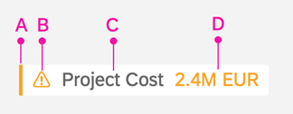
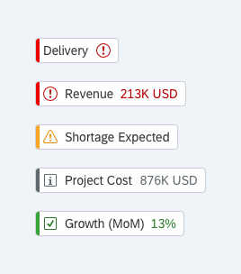
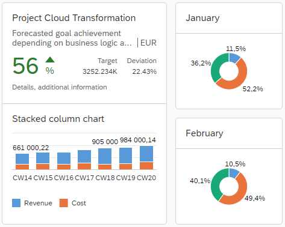
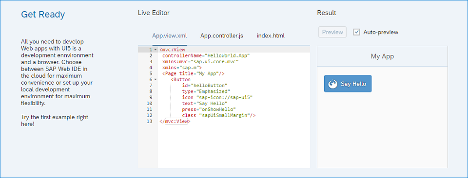

<!-- loio27eea38eeb7b40d19d0dfe3ddf513175 -->

| loio |
| -----|
| 27eea38eeb7b40d19d0dfe3ddf513175 |

view on: [demo kit nightly build](https://openui5nightly.hana.ondemand.com/#/topic/27eea38eeb7b40d19d0dfe3ddf513175) | [demo kit latest release](https://openui5.hana.ondemand.com/#/topic/27eea38eeb7b40d19d0dfe3ddf513175)

## What's New in OpenUI5 1.62

With this release OpenUI5 is upgraded from version 1.61 to 1.62.

***

<a name="loio27eea38eeb7b40d19d0dfe3ddf513175__section_bkm_s15_zcb"/>

### New Controls

<table>
<tr>
<td valign="top">

**`sap.m.GenericTag`**

The new `sap.m.GenericTag` control displays complimentary information related to the current page, such as key performance indicators \(KPI\) and situations.

  

It consists of four different parts:

-   A required status indicator with semantic colors \(A\)

-   An optional icon that is displayed in the same color as the status indicator \(B\)

-   A required text that is truncated automatically \(C\)

-   An optional content area that can display either a control of type `sap.m.ObjectNumber` or a warning icon \(D\)

  

The control can move to the overflow area of `sap.m.OverflowToolbar`.

For more information, see the [API Reference](https://openui5.hana.ondemand.com/#/api/sap.m.GenericTag) and the [Samples](https://openui5.hana.ondemand.com/#/entity/sap.m.GenericTag).

</td>
</tr>
<tr>
<td valign="top">

**`sap.ui.integration.widgets.Card`**

A card is a user experience design pattern that displays the most concise pieces of information in a limited-space container. It helps users structure their work in an intuitive and dynamic way.

  
  
<a name="loio27eea38eeb7b40d19d0dfe3ddf513175__fig_pfj_mhs_5fb"/>Analytical card

  

Using cards, you can group information, link additional details, and present a summary. You can also get direct insights without leaving the current screen and choose further navigation options. Each card is designed in a different style and contains various content formats.

-   The List card is used to display multiple list items of all kinds.

-   The Analytical card is used for data visualization with various chart types.

Cards can be used by referencing the `sap.ui.integration` library.

`sap.ui.integration.widgets.Card` is a self-contained user interface element, connected to a manifest and used as a widget.

For more information, see [Cards](Cards_5b46b03.md), the [API Reference](https://openui5.hana.ondemand.com/#/api/sap.ui.integration.widgets.Card), and the [Samples](https://openui5.hana.ondemand.com/#/entity/sap.ui.integration.widgets.Card).

</td>
</tr>
</table>

***

<a name="loio27eea38eeb7b40d19d0dfe3ddf513175__section_qwl_pb5_zcb"/>

### Improved Features

<table>
<tr>
<td valign="top">

**Routing in Nested Components**

OpenUI5 routing now supports navigation to components in addition to the already existing routing to views. You configure the routing in the component’s manifest. Moreover, the target component can also come with its own routing, which integrates via enhanced configuration in the manifest.

For details, see [Enabling Routing in Nested Components](Enabling_Routing_in_Nested_Components_fb19f50.md).

</td>
</tr>
<tr>
<td valign="top">

**OpenUI5 OData V4 Model**

The new version of the OpenUI5 OData V4 model introduces the following features:

-   Bound actions on collections can now be executed using the header context of the `sap.ui.model.odata.v4.ODataListBinding`. If the returned entity is part of the same entity set, the promise of `sap.ui.model.odata.v4.ODataContextBinding#execute` can be resolved with a return value context.

-   `sap.ui.model.odata.v4.Context#requestSideEffects` was introduced in OpenUI5 1.61 and now resolves side effects in :n navigations reloading only affected properties.

-   The `##` syntax for branching into the `MetaModel` as described in `sap.ui.model.odata.v4.ODataModel#bindProperty` is now also available in property bindings.

-   Non-primitive values are supported in property bindings with binding mode `OneTime` and target type `"any"`.

-   The following methods can now be executed while a binding is suspended:

    -   `filter`, `sort`, `changeParameters`, `setAggregation`, and `updateAnalyticalInfo` of `sap.ui.model.odata.v4.ODataListBinding`

    -   `changeParameters` of `sap.ui.model.odata.v4.ODataContextBinding`

    -   `refresh` method of all bindings

    When the binding is resumed, a request reflecting all the changes by these methods is triggered.

> ### Restriction:  
> Due to the limited feature scope of this version of the OpenUI5 OData V4 model, check that all required features are in place before developing applications. Check the detailed documentation of the features, as certain parts of a feature may be missing. While we aim to be compatible with existing controls, some controls might not work due to small incompatibilities compared to `sap.ui.model.odata.(v2.)ODataModel`, or due to missing features in the model \(such as tree binding\). This also applies to controls such as `TreeTable` and `AnalyticalTable`, which are not supported together with the OpenUI5 OData V4 model. The interface for applications has been changed for easier and more efficient use of the model. For a summary of these changes, see [Changes Compared to OData V2 Model](Changes_Compared_to_OData_V2_Model_abd4d7c.md).

For more information, see [OData V4 Model](OData_V4_Model_5de13cf.md), the [API Reference](https://openui5.hana.ondemand.com/#/api/sap.ui.model.odata.v4), and the [Samples](https://openui5.hana.ondemand.com/#/entity/sap.ui.model.odata.v4.ODataModel).

</td>
</tr>
</table>

***

<a name="loio27eea38eeb7b40d19d0dfe3ddf513175__section_rqn_wd5_zcb"/>

### Improved Controls

<table>
<tr>
<td valign="top">

**`sap.m.Carousel`**

The control can now display several items at once. This functionality is implemented through a new `customLayout` aggregation of type `sap.m.CarouselLayout`. The `sap.m.CarouselLayout` defines how many items are displayed in the visible area of the `sap.m.Carousel` control and has a `visiblePagesCount` property, which determines the count of items to be displayed.For more information, see the [API Reference](https://openui5.hana.ondemand.com/#/api/sap.m.Carousel) and the [Sample](https://openui5.hana.ondemand.com/#/sample/sap.m.sample.CarouselWithMorePages/preview).

</td>
</tr>
<tr>
<td valign="top">

<code><b><code>sap.m.Column</code></b></code>

The `sortIndicator` property now shows a sort icon when a column is sorted. For more information, see the [API Reference](https://openui5.hana.ondemand.com/#/api/sap.m.Column) for the `sortIndicator` property.

</td>
</tr>
<tr>
<td valign="top">

**`sap.m.ComboBox`**

In order for the `ComboBox` to be aligned with the rest of the input controls and the already available features, we updated the used list structure of the control from `sap.m.SelectList` to `sap.m.List`, and respectively updated the protected API `getList`. For more information, see the [API Reference](https://openui5.hana.ondemand.com/#/api/sap.m.ComboBox).

</td>
</tr>
<tr>
<td valign="top">

<code><b>sap.m.ListBase</b></code>

You can now use more values for the `highlight` property. These values are provided by the `sap.ui.core.MessageType` and `sap.ui.core.IndicationColor` enumerations. To define a custom semantic for the highlight color, you can use the new `highlightText` property. For more information, see the [API Reference](https://openui5.hana.ondemand.com/#/api/sap.m.ListItemBase/controlProperties) for the `highlight` property.

</td>
</tr>
<tr>
<td valign="top">

**`sap.m.OverflowToolbar`**

-   We extended the `sap.m.sample.OverflowToolbarSimple` sample to demonstrate the behavior of grouped controls. It contains two pairs of grouped controls: `Label` with `Input` and `Label` with `Select`.For more information, see the [Sample](https://openui5.hana.ondemand.com/#/sample/sap.m.sample.OverflowToolbarSimple/preview).

-   The `sap.m.OverflowToolbar` now allows `sap.m.GenericTag` to move into the overflow area.For more information, see the [Sample](https://openui5.hana.ondemand.com/#/sample/sap.m.sample.OverflowToolbarSimple/preview).

</td>
</tr>
<tr>
<td valign="top">

**`sap.m.SinglePlanningCalendar`**

-   You can now select or deselect single appointments either by clicking or tapping on the appointment or by using the keyboard arrow keys to navigate to the appointment and then select or deselect it by pressing the space bar or the [Enter\] key. You can enter multi-selection mode using key combinations \(for example, [Ctrl + click\] for Microsoft Windows Operating Systems or [Cmd + click\] for Mac Operating Systems\).

-   The `sap.m.SinglePlanningCalendar` now has a new `stickyMode` property which allows users to select which toolbars will be fixed while scrolling.

For more information, see the [API Reference](https://openui5.hana.ondemand.com/#/api/sap.m.SinglePlanningCalendar) and the [Samples](https://openui5.hana.ondemand.com/#/entity/sap.m.SinglePlanningCalendar).

</td>
</tr>
<tr>
<td valign="top">

<code><b>sap.m.StandardListItem</b></code>

The new `information` value in the `sap.ui.core.ValueState` enumeration is now supported by the `infoState` property of `StandardListItem`. For more information, see the [API Reference](https://openui5.hana.ondemand.com/#/api/sap.m.StandardListItem/methods/getInfoState).

</td>
</tr>
<tr>
<td valign="top">

**`sap.tnt.SideNavigation`**

We have implemented a `selectedKey` property of `sap.tnt.SideNavigation`, with which you can easily set the selected item, when the control is bound to a model. For more information, see the [API Reference](https://openui5.hana.ondemand.com/#/api/sap.tnt.SideNavigation) and the [Sample](https://openui5.hana.ondemand.com/#/sample/sap.tnt.sample.ToolPage/preview).

</td>
</tr>
<tr>
<td valign="top">

**`sap.ui.core.support.RuleEngineOpaExtension`**

The rule engine OPA extension, which allows Support Assistant checks, has been enhanced with a new assertion. The new `getReportAsFileInFormat` assertion allows storing past history in `window._$files` in a preferred format. For more information, see the [API Reference](https://openui5.hana.ondemand.com/#/api/sap.ui.core.support.RuleEngineOpaExtension) and the [Sample](https://openui5.hana.ondemand.com/#/sample/sap.ui.core.sample.OpaWithSupportAssistant/preview).

</td>
</tr>
<tr>
<td valign="top">

**`sap.ui.table.AnalyticalTable`, `sap.ui.table.Table`, `sap.ui.table.TreeTable`**

You can now use more values for the `highlight` property. These values are provided by the `sap.ui.core.MessageType` and `sap.ui.core.IndicationColor` enumerations. To define a custom semantic for the highlight color, you can use the new `highlightText` property. For more information, see the [API Reference](https://openui5.hana.ondemand.com/#/api/sap.ui.table.RowSettings) for the `highlight` property.

</td>
</tr>
</table>

***

<a name="loio27eea38eeb7b40d19d0dfe3ddf513175__section_r5v_3h5_zcb"/>

### Demo Kit Improvements

<table>
<tr>
<td valign="top">

**Demo Kit Landing Page**

-   We added a block on the welcome page about the *UI5 Evolution* project. It contains a short description with a link to the interactive documentation page about the project. For more information, see [Best Practices for App Developers](Best_Practices_for_App_Developers_28fcd55.md).

-   We added a live code editor to the Demo Kit welcome page that showcases a simple app. You can edit the code directly and see your changes immediately in the *Result* area.

    

</td>
</tr>
<tr>
<td valign="top">

**Settings Dialog in Samples Section**

You can now switch the *Content Density* of the Demo Kit samples to *Condensed*.

</td>
</tr>
</table>

**Parent topic:** [Previous Versions](Previous_Versions_6660a59.md "")

**Related Information**  

[What's New in OpenUI5 1.100](What_s_New_in_OpenUI5_1_100_5deb78f.md "With this release OpenUI5 is upgraded from version 1.99 to 1.100.")

[What's New in OpenUI5 1.99](What_s_New_in_OpenUI5_1_99_5e35c25.md "With this release OpenUI5 is upgraded from version 1.98 to 1.99.")

[What's New in OpenUI5 1.98](What_s_New_in_OpenUI5_1_98_7aacb4e.md "With this release OpenUI5 is upgraded from version 1.97 to 1.98.")

[What's New in OpenUI5 1.97](What_s_New_in_OpenUI5_1_97_f21858f.md "With this release OpenUI5 is upgraded from version 1.96 to 1.97.")

[What's New in OpenUI5 1.96](What_s_New_in_OpenUI5_1_96_b39a11b.md "With this release OpenUI5 is upgraded from version 1.95 to 1.96.")

[What's New in OpenUI5 1.95](What_s_New_in_OpenUI5_1_95_1b09465.md "With this release OpenUI5 is upgraded from version 1.94 to 1.95.")

[What's New in OpenUI5 1.94](What_s_New_in_OpenUI5_1_94_2d6ffdd.md "With this release OpenUI5 is upgraded from version 1.93 to 1.94.")

[What's New in OpenUI5 1.93](What_s_New_in_OpenUI5_1_93_e9c8356.md "With this release OpenUI5 is upgraded from version 1.92 to 1.93.")

[What's New in OpenUI5 1.92](What_s_New_in_OpenUI5_1_92_1492551.md "With this release OpenUI5 is upgraded from version 1.91 to 1.92.")

[What's New in OpenUI5 1.91](What_s_New_in_OpenUI5_1_91_75777da.md "With this release OpenUI5 is upgraded from version 1.90 to 1.91.")

[What's New in OpenUI5 1.90](What_s_New_in_OpenUI5_1_90_b475202.md "With this release OpenUI5 is upgraded from version 1.89 to 1.90.")

[What's New in OpenUI5 1.89](What_s_New_in_OpenUI5_1_89_0805036.md "With this release OpenUI5 is upgraded from version 1.88 to 1.89.")

[What's New in OpenUI5 1.88](What_s_New_in_OpenUI5_1_88_bda141b.md "With this release OpenUI5 is upgraded from version 1.87 to 1.88.")

[What's New in OpenUI5 1.87](What_s_New_in_OpenUI5_1_87_e315108.md "With this release OpenUI5 is upgraded from version 1.86 to 1.87.")

[What's New in OpenUI5 1.86](What_s_New_in_OpenUI5_1_86_067e2fb.md "With this release OpenUI5 is upgraded from version 1.85 to 1.86.")

[What's New in OpenUI5 1.85](What_s_New_in_OpenUI5_1_85_eeb5bd9.md "With this release OpenUI5 is upgraded from version 1.84 to 1.85.")

[What's New in OpenUI5 1.84](What_s_New_in_OpenUI5_1_84_ccf76b7.md "With this release OpenUI5 is upgraded from version 1.82 to 1.84.")

[What's New in OpenUI5 1.82](What_s_New_in_OpenUI5_1_82_f081cf0.md "With this release OpenUI5 is upgraded from version 1.81 to 1.82.")

[What's New in OpenUI5 1.81](What_s_New_in_OpenUI5_1_81_f71563c.md "With this release OpenUI5 is upgraded from version 1.80 to 1.81.")

[What's New in OpenUI5 1.80](What_s_New_in_OpenUI5_1_80_3294c68.md "With this release OpenUI5 is upgraded from version 1.79 to 1.80.")

[What's New in OpenUI5 1.79](What_s_New_in_OpenUI5_1_79_edf8e35.md "With this release OpenUI5 is upgraded from version 1.78 to 1.79.")

[What's New in OpenUI5 1.78](What_s_New_in_OpenUI5_1_78_d176be3.md "With this release OpenUI5 is upgraded from version 1.77 to 1.78.")

[What's New in OpenUI5 1.77](What_s_New_in_OpenUI5_1_77_2ec6b6b.md "With this release OpenUI5 is upgraded from version 1.76 to 1.77.")

[What's New in OpenUI5 1.76](What_s_New_in_OpenUI5_1_76_b9b0a3f.md "With this release OpenUI5 is upgraded from version 1.75 to 1.76.")

[What's New in OpenUI5 1.75](What_s_New_in_OpenUI5_1_75_dc3d3ce.md "With this release OpenUI5 is upgraded from version 1.74 to 1.75.")

[What's New in OpenUI5 1.74](What_s_New_in_OpenUI5_1_74_21fc6cb.md "With this release OpenUI5 is upgraded from version 1.73 to 1.74.")

[What's New in OpenUI5 1.73](What_s_New_in_OpenUI5_1_73_7b82664.md "With this release OpenUI5 is upgraded from version 1.72 to 1.73.")

[What's New in OpenUI5 1.72](What_s_New_in_OpenUI5_1_72_25e5326.md "With this release OpenUI5 is upgraded from version 1.71 to 1.72.")

[What's New in OpenUI5 1.71](What_s_New_in_OpenUI5_1_71_609fd01.md "With this release OpenUI5 is upgraded from version 1.70 to 1.71.")

[What's New in OpenUI5 1.70](What_s_New_in_OpenUI5_1_70_4e89fee.md "With this release OpenUI5 is upgraded from version 1.69 to 1.70.")

[What's New in OpenUI5 1.69](What_s_New_in_OpenUI5_1_69_41203fd.md "With this release OpenUI5 is upgraded from version 1.68 to 1.69.")

[What's New in OpenUI5 1.68](What_s_New_in_OpenUI5_1_68_5531aef.md "With this release OpenUI5 is upgraded from version 1.67 to 1.68.")

[What's New in OpenUI5 1.67](What_s_New_in_OpenUI5_1_67_0968958.md "With this release OpenUI5 is upgraded from version 1.66 to 1.67.")

[What's New in OpenUI5 1.66](What_s_New_in_OpenUI5_1_66_ebe7fda.md "With this release OpenUI5 is upgraded from version 1.65 to 1.66.")

[What's New in OpenUI5 1.65](What_s_New_in_OpenUI5_1_65_9d2b189.md "With this release OpenUI5 is upgraded from version 1.64 to 1.65.")

[What's New in OpenUI5 1.64](What_s_New_in_OpenUI5_1_64_1975e30.md "With this release OpenUI5 is upgraded from version 1.63 to 1.64.")

[What's New in OpenUI5 1.63](What_s_New_in_OpenUI5_1_63_77e1dcc.md "With this release OpenUI5 is upgraded from version 1.62 to 1.63.")

[What's New in OpenUI5 1.61](What_s_New_in_OpenUI5_1_61_de4d50b.md "With this release OpenUI5 is upgraded from version 1.60 to 1.61.")

[What's New in OpenUI5 1.60](What_s_New_in_OpenUI5_1_60_2a70354.md "With this release OpenUI5 is upgraded from version 1.58 to 1.60.")

[What's New in OpenUI5 1.58](What_s_New_in_OpenUI5_1_58_b28edde.md "With this release, OpenUI5 is upgraded from version 1.56 to 1.58.")

[What's New in OpenUI5 1.56](What_s_New_in_OpenUI5_1_56_53b4b5e.md "With this release, OpenUI5 is upgraded from version 1.54 to 1.56.")

[What's New in OpenUI5 1.54](What_s_New_in_OpenUI5_1_54_f29023e.md "With this release, OpenUI5 is upgraded from version 1.52 to 1.54.")

[What's New in OpenUI5 1.52](What_s_New_in_OpenUI5_1_52_a09dd79.md "With this release, OpenUI5 is upgraded from version 1.50 to 1.52.")

[What's New in OpenUI5 1.50](What_s_New_in_OpenUI5_1_50_a844984.md "With this release, OpenUI5 is upgraded from version 1.48 to 1.50.")

[What's New in OpenUI5 1.48](What_s_New_in_OpenUI5_1_48_2818f80.md "With this release, OpenUI5 is upgraded from version 1.46 to 1.48.")

[What's New in OpenUI5 1.46](What_s_New_in_OpenUI5_1_46_4cf0986.md "With this release, OpenUI5 is upgraded from version 1.44 to 1.46.")

[What's New in OpenUI5 1.44](What_s_New_in_OpenUI5_1_44_05ce1dc.md "With this release, OpenUI5 is upgraded from version 1.42 to 1.44.")

[What's New in OpenUI5 1.42](What_s_New_in_OpenUI5_1_42_4768f1a.md "With this release, OpenUI5 is upgraded from version 1.40 to 1.42.")

[What's New in OpenUI5 1.40](What_s_New_in_OpenUI5_1_40_e659bd2.md "With this release, OpenUI5 is upgraded from version 1.38 to 1.40.")

[What's New in OpenUI5 1.38](What_s_New_in_OpenUI5_1_38_6a875f9.md#loio6a875f998994489483e8085705347d72 "With this release, OpenUI5 is upgraded from version 1.36 to 1.38.")

