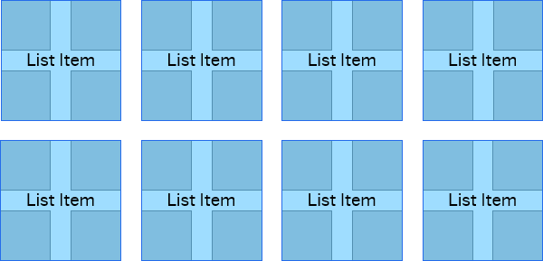

<!-- loio2fc256be1b4649048b125320628e12f0 -->

| loio |
| -----|
| 2fc256be1b4649048b125320628e12f0 |

view on: [demo kit nightly build](https://openui5nightly.hana.ondemand.com/topic/2fc256be1b4649048b125320628e12f0) | [demo kit latest release](https://sdk.openui5.org/topic/2fc256be1b4649048b125320628e12f0)

## sap.f.GridList

The `GridList` allows you to use different types of layouts responsible for the positioning and responsiveness of the content.

***

<a name="loio2fc256be1b4649048b125320628e12f0__section_dvh_qv2_5fb"/>

### Overview

A grid is a two-dimensional structure composed of a series of intersecting vertical and horizontal guidelines used to structure content. The grid serves as a framework in which you can organize controls in a consistent way throughout the design. Dividing a design space into a grid can help position individual elements in a visually appealing manner, facilitate the representation of a user flow, and make information more comprehensible and accessible.

With the new `sap.f.GridList`control, you can easily organize and align your content according to your preferences.

   
  
<a name="loio2fc256be1b4649048b125320628e12f0__fig_pfj_mhs_5fb"/>An example of a uniform grid layout, where all the grid items in a grout take the same dimensions

  

   
  
<a name="loio2fc256be1b4649048b125320628e12f0__fig_pt5_d4r_1gb"/>GridList allows for high flexibility layouts, where the app developer can decide on the specific placement and sizing of the grid items

  

***

<a name="loio2fc256be1b4649048b125320628e12f0__section_vmq_gw2_5fb"/>

### Layouts

`sap.f.GridList` allows application developers to display list items in a two-dimensional grid where the visual layout/display options can be configured flexibly using predefined and custom templates. The layout used is based on the CSS display grid and has a default configuration that displays the list items in a grid.

***

#### `sap.ui.layout.GridBoxLayout`

`sap.ui.layout.GridBoxLayout` is a layout that allows you to position controls in a grid, relative to one another, using constraints defined by its `boxWidth`, `boxMinWidh` or `boxesPerRowConfig` properties.

-   `boxMinWidth` allows the items inside `sap.ui.layout.GridBoxLayout` to accommodate the available width without allowing them to be smaller than the specified `boxMinWidth`.

-   `boxWidth` sets the exact width of the items inside `sap.ui.layout.GridBoxLayout` regardless of the remaining space available in the row.

-   `boxesPerRowConfig` allows the alignment and specification of the number of items in a row, depending on the browser viewport size.

> ### Note:  
> -   The height of all items is set to the height of the highest item.
> 
> -   If the `boxWidth` property is set, `boxMinWidth` and `boxesPerRowConfig` properties are ignored. If the `boxMinWidth` property is set, `boxesPerRowConfig` property is ignored.

**Related Information**  

[API Reference: `sap.f.GridList`](https://sdk.openui5.org/api/symbols/sap.f.GridList)

[Samples: `sap.f.GridList`](https://sdk.openui5.org/entity/sap.f.GridList)

